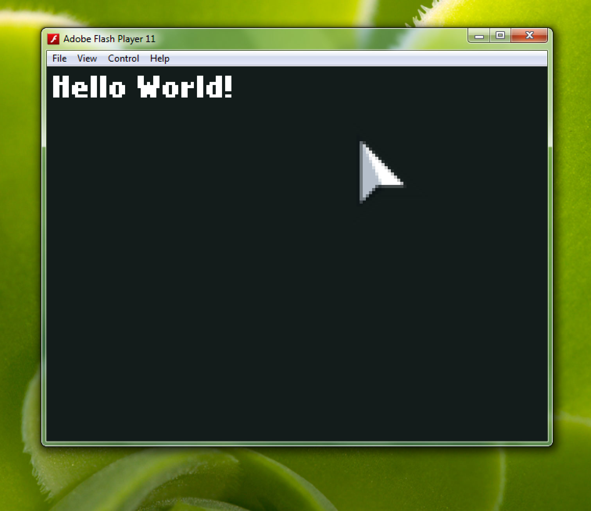

```
title: "Hello World Command Line"
```
"Hello World" is a [common example](http://en.wikipedia.org/wiki/Hello_world_program) of getting started with programming, here we will show you how to add Hello World with HaxeFlixel's `FlxText`. You can compile this test for any supported target platform.

Using the command line with HaxeFlixel is made easier with our custom built flixel-tools utility, also made with Haxe.

## Installation of flixel-tools

You first need to install and setup flixel-tools - please refer to [this guide](/documentation/flixel-tools/) for doing so.

## Create a new HaxeFlixel Project Template

HaxeFlixel requires a basic structure of files for any project that you can automatically create with the `template` command (`tpl` for short).

``` bash
flixel tpl -n "HelloWorld"
```

You will now see a new folder named "HelloWorld" with all the files for your project being created automatically.

## Add the "Hello World" FlxText

Adding the text is as simple as opening the `MenuState.hx` file in the newly created source folder.

The file will look like this:

``` haxe
package;

import flixel.FlxG;
import flixel.FlxSprite;
import flixel.FlxState;
import flixel.text.FlxText;
import flixel.ui.FlxButton;
import flixel.math.FlxMath;

class MenuState extends FlxState
{
	override public function create():Void
	{
		super.create();
	}

	override public function update(elapsed:Float):Void
	{
		super.update(elapsed);
	}
}
```

All you need to do is add the following in the `create()` function:

``` haxe
add(new FlxText(0, 0, 0, "Hello World!")); 
```

Save the file and return to your command line window. Now we can compile the project.

Without running the [lime setup](/documentation/install-openfl) commands you can compile to Flash and Neko out of the box.

Test your project from the following commands:

``` bash
lime test flash
lime test neko
```

If you struggled through any part of this tutorial, ask a question on our [forum](http://forum.haxeflixel.com/) :)


