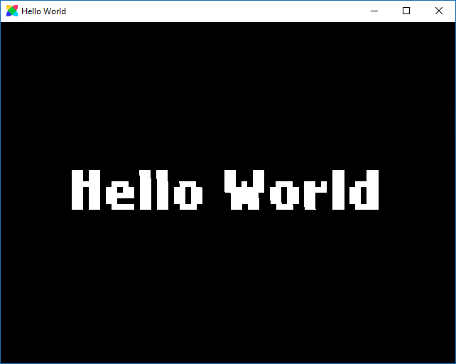

```
title: "Hello World Command Line"
```
"Hello World" is a [common example](http://en.wikipedia.org/wiki/Hello_world_program) of getting started with programming, here we will show you how to add Hello World with HaxeFlixel's `FlxText`. You can compile this test for any supported target platform.

Make sure you have installed Flixel, as well as set up the `lime` and `flixel` commands [as explained previously](/documentation/install-haxeflixel/).

### Create a new HaxeFlixel Project

HaxeFlixel requires a basic structure of files for any project that you can automatically create with the `template` command (`tpl` for short).

``` bash
flixel tpl -n "HelloWorld"
```

You will now see a new folder named "HelloWorld" with all the files for your project being created automatically.

### Add the "Hello World" `FlxText`

Adding the text is as simple as opening the `PlayState.hx` file in the newly created `source` folder. The file should look like this:

``` haxe
package;

import flixel.FlxG;
import flixel.FlxSprite;
import flixel.FlxState;
import flixel.text.FlxText;
import flixel.ui.FlxButton;
import flixel.math.FlxMath;

class PlayState extends FlxState
{
	override public function create():Void
	{
		super.create();
	}

	override public function update(elapsed:Float):Void
	{
		super.update(elapsed);
	}
}
```

All you need to do is add the following three lines to the `create()` function (and save the file):

``` haxe
var text = new FlxText(0, 0, 0, "Hello World", 64);
text.screenCenter();
add(text);
```

This will create a new `FlxText` instance with font size `64`, center it on the screen and `add()` it so it is displayed.

### Test the Project

Return to your command line window. Now we can compile the project.

Without running the `lime setup` commands you can compile to Flash, Neko and HTML5 out of the box.

Test your project with the following commands:

``` bash
lime test flash
lime test neko
lime test html5
```

If you struggled through any part of this tutorial, ask a question on our [forum](http://forum.haxeflixel.com/). :)


