```
title: "Visual Studio Code"
```

[](https://marketplace.visualstudio.com/items?itemName=vshaxe.haxe-extension-pack)

[Visual Studio Code](https://code.visualstudio.com/) is an open-source, cross-platform, lightweight code editor by Microsoft. The [Haxe extension](https://marketplace.visualstudio.com/items?itemName=nadako.vshaxe) seamlessly integrates with the compiler's [IDE services](https://haxe.org/manual/cr-completion.html) and uses them for:

- Code Completion
- Go to Definition
- Go to Symbol
- Find Usages
- Finding Unused Imports
- etc...

You can find detailed documentation for the Haxe extension in the [Wiki](https://github.com/vshaxe/vshaxe/wiki), this page focuses on the Flixel-specific parts.

### Installation

- Download and install the latest version of [Visual Studio Code](https://code.visualstudio.com/).
- Go to the Extensions tab and install the [Lime extension](https://marketplace.visualstudio.com/items?itemName=openfl.lime-vscode-extension). This automatically installs the Haxe extension as well.

    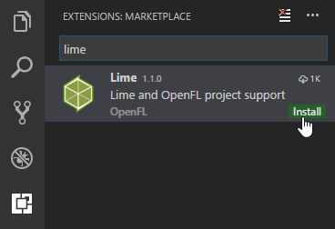

### Project Configuration

VSCode stores its project-specific settings in a `.vscode` subfolder - [flixel-tools](http://haxeflixel.com/documentation/flixel-tools/) can create one with sensible defaults for Flixel projects. Just select VSCode as your preferred editor during the `setup` command, or add `-ide vscode` to the command you're running.

**Note:** make sure you have the latest versions of flixel-tools and flixel-templates:

```
haxelib update flixel-tools
haxelib update flixel-templates
```

You have several options for creating projects with a `.vscode` configuration:

1. Create a new, empty project:

    ```
    flixel template -n "VSCodeTest" -ide vscode
    ```

2. Create a new project based on one of the [demos](/demos):

    ```
    flixel create -ide vscode
    ```

3. Add the `.vscode` folder to a project that already exists, for instance the current working directory:

    ```
    flixel configure . -ide vscode
    ```

4. Add VSCode config files to an entire directory of projects, like flixel-demos:

    ```
    flixel configure C:\HaxeToolkit\haxe\lib\flixel-demos\git -ide vscode
    ```

### Code Completion

Once you've installed the Lime extension and have a project with a `.vscode` folder, just open it with `File` -> `Open Folder`. If the workspace was correctly detected as a Lime project (needs a `Project.xml` file), you should notice these dropdown menus appearing in the status bar:

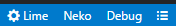

Code completion features should work out of the box now:

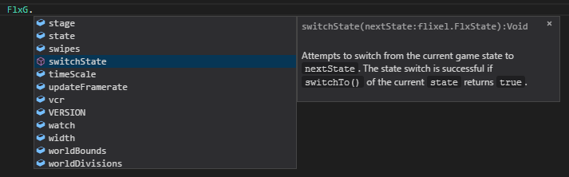

If you're having trouble, please refer to the Haxe extension's [Troubleshooting guide](https://github.com/vshaxe/vshaxe/wiki/Troubleshooting).

### Building

Building and running your projects in VSCode is done through _tasks_. You can view the list of available tasks via `Tasks` -> `Run Task...`:

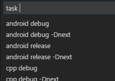

To build and run your project, select the `lime: test` task. With Flixel's template, this is configured as the default build task, so you can also invoke it directly via `Tasks` -> `Run Build Task...` or by pressing `Ctrl+Shift+B`:

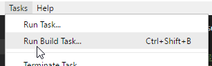

You may want to assign a shortcut to `Run Task...` or change the shortcut for `Run Build Task...` to something more convenient such as `F5`. You can do so in `File` -> `Preferences` -> `Keyboard Shortcuts`.

Finally, you can change the target and build configuration (Debug, Release, Final) by using the dropdown menus in the status bar:

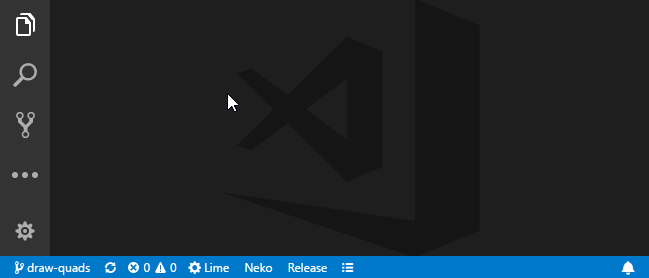


### Compiler Errors / Problems View

If you get compiler error(s) during the build, errors may show up in the _Output_ view at the bottom of the screen. You will notice that errors are _not_ clickable here.

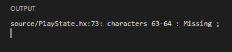

However, VSCode does have a _Problems_ view supporting double-click navigation (comparable to the Results panel in FlashDevelop). Just press `Ctrl+Shift+M` or click on the problems / warnings count in the status bar:

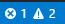

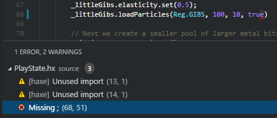

### Flash Debugging

The `.vscode` template from flixel-tools already includes the `launch.json` needed for Flash debugging. To make use of it, you also need to install the [Haxe Debug extension](https://marketplace.visualstudio.com/items?itemName=vshaxe.haxe-debug). Make sure that:

1. Java is installed and available.
2. The "Flash Player projector content debugger" is associated with `.swf` files.

Check the [usage section of the Readme](https://github.com/vshaxe/vshaxe-debugadapter#usage) for detailed instructions.

After this, you just have to select one of the launch configs to start debugging:

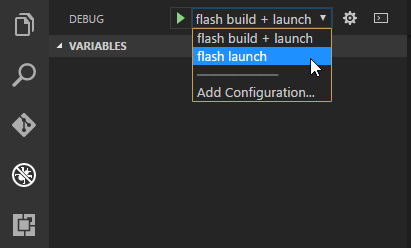

Here's what it should look like when you hit a breakpoint:

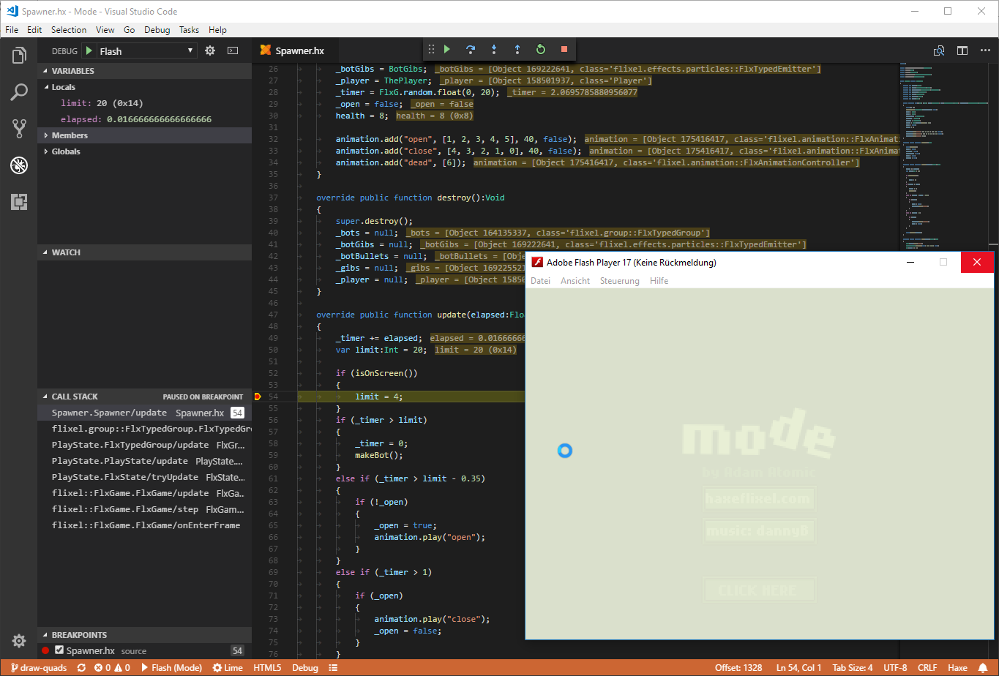