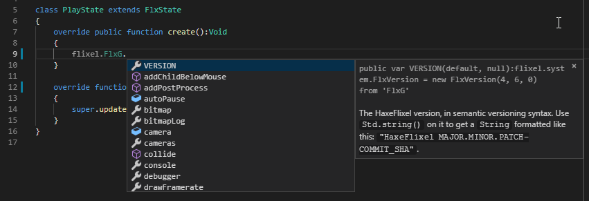

```
title: "Visual Studio Code"
```

[](https://marketplace.visualstudio.com/items?itemName=vshaxe.haxe-extension-pack)

[Visual Studio Code](https://code.visualstudio.com/) is an open-source, cross-platform, lightweight code editor by Microsoft. Although it still has a few rough edges, the [Haxe Extension Pack](https://marketplace.visualstudio.com/items?itemName=vshaxe.haxe-extension-pack) arguably turns VSCode into the editor with the most advanced Haxe support available right now. It seamlessly integrates with the compiler's [IDE services](https://haxe.org/manual/cr-completion.html) and uses them for:

- code completion
- go to definition
- go to symbol
- find usages
- finding unused imports
- etc...

The Haxe extension requires [Haxe 3.4.0](http://haxe.org/download/) or newer.

You can find detailed documentation for vshaxe in the [Wiki](https://github.com/vshaxe/vshaxe/wiki), this page focuses on the Flixel-specific parts.

### Configuring for use with Flixel Projects

VSCode stores its project-specific settings in a `.vscode` subfolder - [flixel-tools](http://haxeflixel.com/documentation/flixel-tools/) can create this folder for you. Just make sure to select VSCode as your preferred during the `setup` command, or add `-ide vscode` to the command you're running.

From here, there are four options. **Note:** it's recommended to use the latest versions of flixel-tools and flixel-templates.

1. Create a new, empty project:

    ```
    flixel template -n "VSCodeTest" -ide vscode
    ```

2. Create a new project based on one of the [demos](/demos):

    ```
    flixel create -ide vscode
    ```

3. Add the `.vscode` folder to a project that already exists, for instance the current working directory:

    ```
    flixel configure . -ide vscode
    ```

4. Add VSCode config files to an entire directory of projects, like flixel-demos:

    ```
    flixel configure C:\HaxeToolkit\haxe\lib\flixel-demos\git -ide vscode
    ```

### Building your Project

Building and running your projects in VSCode is done through _tasks_. The pre-configured tasks are contained in `.vscode/tasks.json`. To access the list of available tasks, press `Ctrl+Shift+P`, type `run task`, `Down` and `Enter`.


Because this is a bit tedious, it's recommended to add a shortcut for opening this menu. To do so, navigate to `File` -> `Preferences` -> `Keyboard Shortcuts` and change `keybindings.json` on the right with the following:

```json
// Place your key bindings in this file to overwrite the defaults
[
    { "key": "ctrl+b", "command": "workbench.action.tasks.runTask" }
]
```

You can now open the list of tasks directly with `Ctrl+B`. Of course, you can also use any other shortcut you'd like.

There is also a _default build task_ you can run with `Ctrl+Shift+B`. By default it is set to `flash debug`. To change this, open `.vscode/tasks.json` and move `"isBuildCommand": true` to another task.

### Compiler Errors / Problems View

If you get compiler error(s) during the build, errors may show up in the _Output_ view at the bottom of the screen. You will notice that errors are _not_ clickable here.


However, VSCode does have a _Problems_ view supporting double-click navigation (comparable to the Results panel in FlashDevelop). Just press `Ctrl+Shift+M` or double-click this button in the status bar:


### Code Completion

If you've correctly installed the Haxe extension and are using a Haxe version higher >= 3.4.0, it should work out of the box. Make sure you've compiled the project at least once with the `flash debug` task (this is done automatically if you used the `template` or `create` command of flixel-tools) - code completion requires `.hxml` files, which are generated in your project's `export` directory during the build. `export/flash/haxe/debug.hxml` is the one used by default, since this is the first entry in `.vscode/settings.json`. It seems to be the most robust right now, other targets have completion errors sometimes.



To switch the active completion config to a target different than Flash, press `Ctrl+Shift+P`, type `haxe`, select `Haxe: Select display configuration` and then select one of the entries in the dropdown. Alternatively, click this button in the status bar (you need to have a `.hx` file open for it to be visible):


Again, note that you should have compiled for these targets at least once for the `.hxml` files to be created by Lime. Changing the selected config is comparable to changing the selection in FlashDevelop's target dropdown, except it doesn't have any effect on building.

### Flash Debugging

The "Haxe Debug" extension that is included in the extension pack also allows you to debug Flixel games on the Flash target. The necessary launch configs are included in the `.vscode` folder generated by flixel-tools (starting with flixel-templates 2.2.0), and Flixel's `tasks.json` makes sure the `-Dfdb` flag is set when compiling `.swf` files. With those two prerequisites already taken care of, you just have to make sure that:

1. Java is installed and available.
2. The "Flash Player projector content debugger" is associated with `.swf` files.

See [vshaxe-debugadapter's Readme](https://github.com/vshaxe/vshaxe-debugadapter#usage) for more details.

After this, you just have to select one of the launch configs to start debugging:


Here's what it looks like in action:

