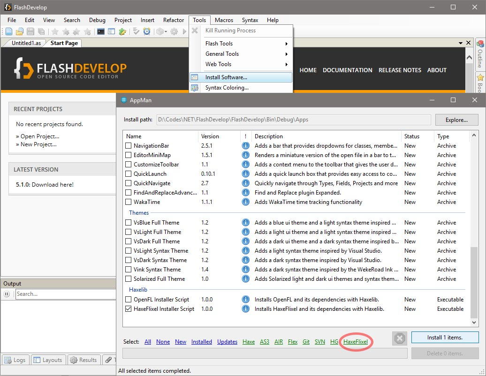
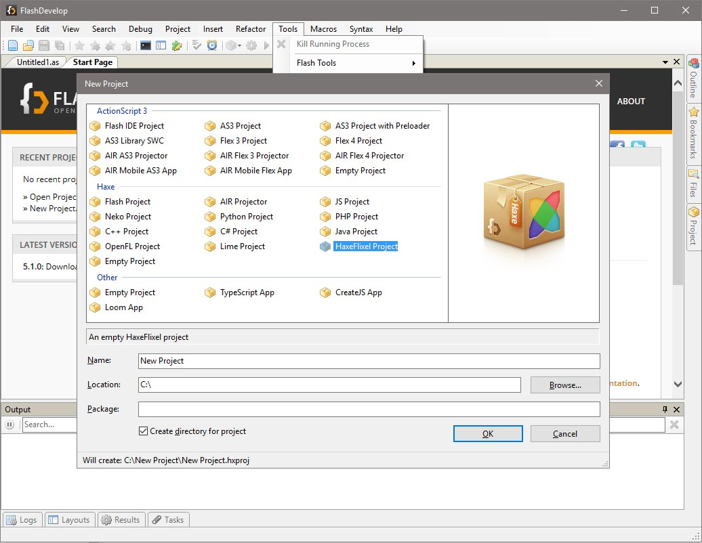

```
title: "FlashDevelop"
```

[FlashDevelop](http://www.flashdevelop.org/) is a free and open source (MIT license) source code editor and offers first class support for Haxe development: great and fast code completion & code generation, projects compilation & debugging, plenty of project templates, SWF/SWC exploration, etc. FlashDevelop is one of the most popular Haxe IDEs.

FlashDevelop is more generally a great web developer IDE with integrated source-control support
(svn, git, mercurial), tasks/todo, snippets, XML/HTML/CSS completion and built-in zen-coding for HTML.

See FlashDevelop wiki for more information: http://www.flashdevelop.org/wikidocs/index.php

To install FlashDevelop please see the official documentation for detailed instructions: http://www.flashdevelop.org/wikidocs/index.php?title=Installation

### Installing HaxeFlixel

In FlashDevelop you can install Haxe and/or HaxeFlixel and its template easily from the AppMan: (Tools -> Install Software...). Select items individually or click the green HaxeFlixel selector link on the bottom and then click Install. After the install is finished, restart FlashDevelop so that the changes get picked up properly.





FlashDevelop is open source and you can contribute to it through their [GitHub repository](https://github.com/fdorg/flashdevelop).
