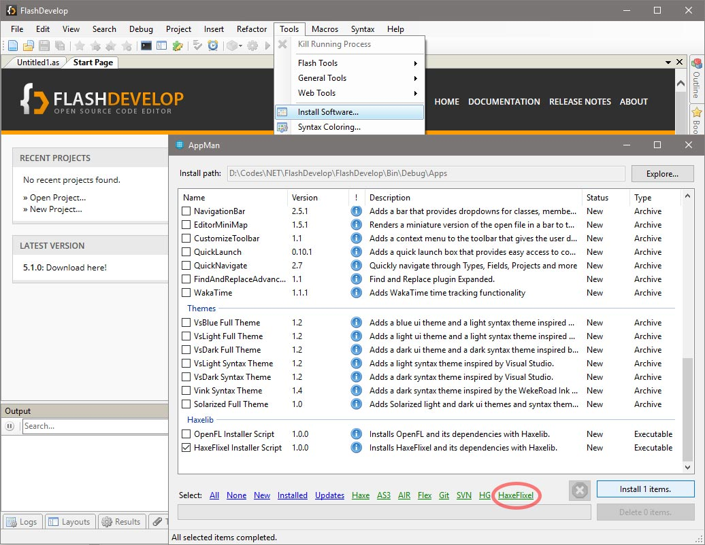
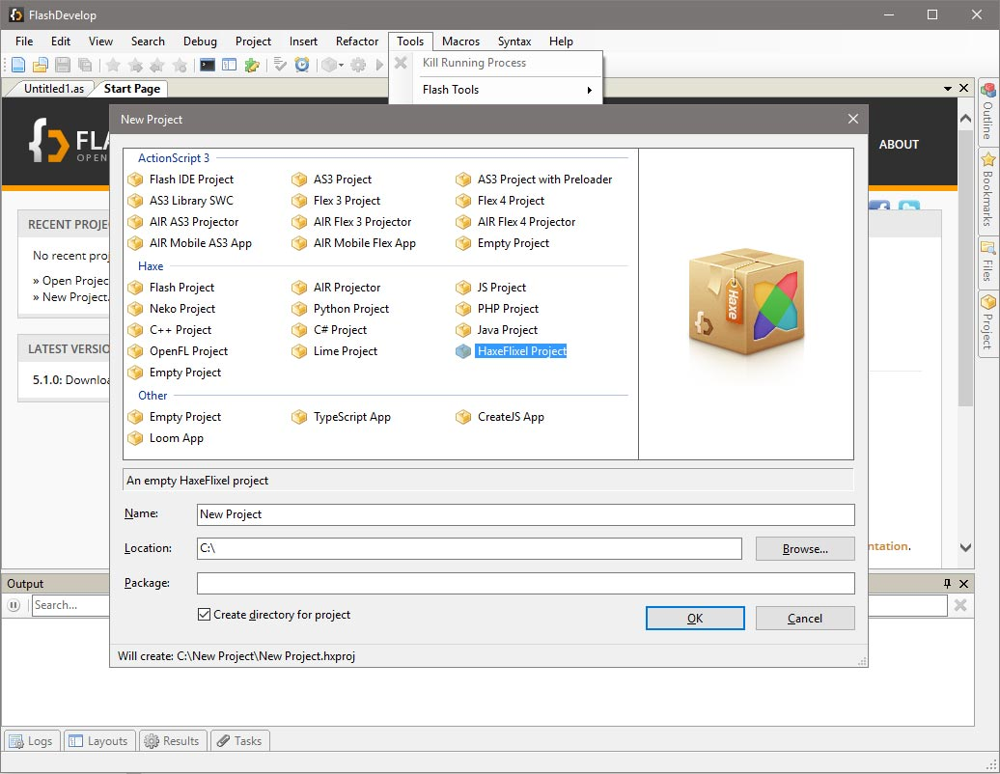

```
title: "HaxeDevelop"
```

[HaxeDevelop](https://haxedevelop.org/) is a distribution of FlashDevelop optimized for Haxe development. Is a free and open source (MIT license) source code editor and offers great and fast code completion & code generation, project compilation & debugging, plenty of project templates. It's one of the most popular Haxe IDEs. See their [wiki]( http://www.flashdevelop.org/wikidocs/index.php) for more information.

### Installing HaxeFlixel

In HaxeDevelop, you can install Haxe and/or HaxeFlixel and its template easily from the "AppMan": (Tools -> Install Software...). Select items individually or click the green HaxeFlixel selector link on the bottom and then click Install. After the install is finished, restart HaxeDevelop so that the changes get picked up properly.





HaxeDevelop is open source and you can contribute to it through their [GitHub repository](https://github.com/fdorg/flashdevelop).
