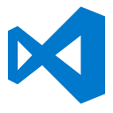
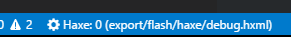
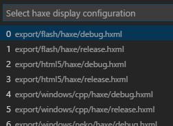

[Visual Studio Code](https://code.visualstudio.com/) is a fairly new, open-source, cross-platform, lightweight code editor by Microsoft. Although it still has a few rough edges, the [Haxe extension](https://github.com/vshaxe/vshaxe) arguably turns VSCode into the editor with the most advanced Haxe support available right now. Being developed by some of the Haxe compiler's maintainers, it has great integration of the compiler's [IDE services](https://haxe.org/manual/cr-completion.html) and uses them for:

- code completion
- go to definition
- go to symbol
- find usages
- finding unused imports
- etc...

The Haxe extension requires Haxe 3.3.0-rc1 or newer.

### Configuring for use with Flixel projects

VSCode stores its project-specific settings in a `.vscode` subfolder. Getting the configurations right manually is a bit tedious, which is why you can use [flixel-tools](http://haxeflixel.com/documentation/flixel-tools/) to create a new template project or demo with a pre-created config. Simply make sure to select VSCode as your editor of choice during the `setup` command, or add `-ide vscode` to the command you're running.

```
flixel template -n "VSCodeTest" -ide vscode
flixel create -ide vscode
```

Alternatively, you can copy the IDE config files to already existing projects. Run this command to add a `.vscode` folder to the current working directory:

```
flixel configure . -ide vscode
```

You can also use this to configure an entire directory or projects, like flixel-demos:

```
flixel configure C:\HaxeToolkit\haxe\lib\flixel-demos\git -ide vscode
```

### Building your Project

Building and running your projects in VSCode is done through _tasks_. The pre-configured tasks are contained in `.vscode/tasks.json`. To access the list of available tasks, press `Ctrl+Shift+P`, type `run task`, `Down` and `Enter`.


Because this is a bit tedious, it's recommended to add a shortcut for opening this menu. To do so, navigate to `File` -> `Preferences` -> `Keyboard Shortcuts` and change `keybindings.json` on the right with the following:

```json
// Place your key bindings in this file to overwrite the defaults
[
    { "key": "ctrl+t", "command": "workbench.action.tasks.runTask" }
]
```

You can now open the list of tasks directly with `Ctrl+T`.

### Code Completion

If you've correctly installed the Haxe extension and are using a Haxe version higher > 3.3.0, it should work out of the box. Make sure you've compiled the project at least once with the `flash debug` task (this is done automatically if you used the `template` or `create` command of flixel-tools) - code completion requires `.hxml` files, which are generated in your project's `export` directory during the build. `export/flash/haxe/debug.hxml` is the one used by default, since this is the first entry in `.vscode/settings.json`. It seems to be the most robust right now, other targets have completion errors sometimes.


To switch the active completion config to a target different than Flash, press `Ctrl+Shift+P`, type `haxe`, select `Haxe: Select display configuration` and then select one of the entries in the dropdown. Alternatively, click this button in the status bar (you need to have a `.hx` file open for it to be visible):





Again, note that you should have compiled for these targets at least once for the `.hxml` files to be created by Lime.