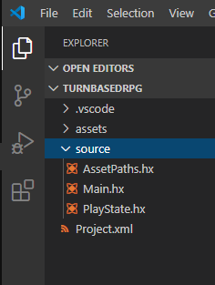
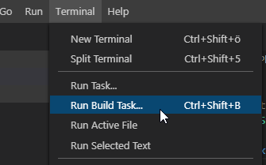
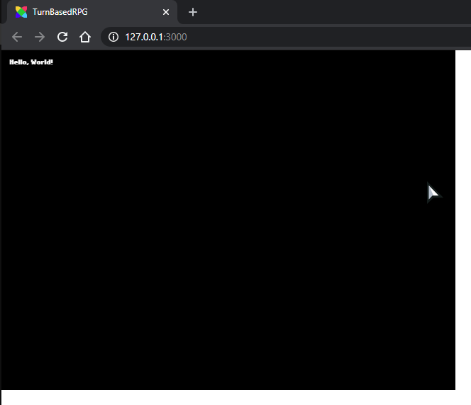

```
title: "2 - Creating a new project"
```

Now we want to make sure that everything is installed properly - and we want to set up the framework for our game. So we're going to make a new project, open it with VSCode and test that it builds and runs.

1. In the command prompt, enter:

	```bash
	flixel tpl -n "TurnBasedRPG" -ide vscode
	```

	This will create a new Flixel project using the blank template in the directory `TurnBasedRPG` (as well as naming the project `TurnBasedRPG`).

2. Depending on how you've configured flixel-tools and whether the `code` command is available, `flixel tpl` might already have opened a VSCode window with the right folder automatically.

	If not, simply open the `TurnBasedRPG` folder with `File > Open Folder...`.

3. Over on the left side of the screen, you should see your project. This will contain all the files that the template generated for us.

	

4. Next, let's make sure that our project builds and runs properly. By default, a fresh, new Flixel template project will launch the game in the `PlayState`. So go ahead and double-click to open that file from the project list.
	This file is a very basic (and empty) example of a `FlxState` subclass. You can think of a `FlxState` a little bit like a 'scene'. When your game is running, one - and only one - state will be the active state. Anything 'added' to that state will be visible and accessible by the player, and, for the most part, will be segregated from other states in your game.

	They are great for having different sections of your game that are sort of in a bubble from one another, such as a `MenuState` (which we will add later) and the `PlayState` (where the game is actually played).

	You'll see that, at least for now, the `PlayState` only has two functions in it: `create()` and `update()`. When a state is loaded, its `create()` function is called. This is where you want to initialize all of the things in your state.

	`update()` is where all the real magic happens - it is called every 'frame' in your game (by default 60 times per second). When a `FlxState`'s `update()` is called, it will call `update()` on all of the objects that have been added to it. This is basically how everything in your game actually 'happens'. We will get to play with this more later on.
	For now, we JUST want to see that the whole thing works, so, we're going to add a simple `FlxText` object to this state.

5. In `create()`, right before the line that says `super.create();`, type out the following two lines:

	```haxe
	var text = new FlxText(10, 10, 100, "Hello, World!");
	add(text);
	```

	While you're typing, code completion should pop up and suggest `FlxText`.

	

	Here, press `Enter` or simply type a `(` - notice how the following lines has automatically been added to your imports at the top of the file:

	```haxe
	import flixel.text.FlxText;
	```

	Then save your changes (or simply enable auto-save via `File > Auto Save`).

8. The moment of truth! Go down to the status bar in VSCode and verify that the HTML5 target is selected in the lower left:

	

	Then run the "build task" (or press the keyboard shortcut for it)!
	
	

	After a short moment, your default browser should pop up with a HaxeFlixel splash screen and then the text we just added:

	

	It worked! You've built and ran your first HaxeFlixel project!

	At this point, you could try building it for Neko, Windows and Android to make sure they all work as well. If you run into problems with any of those, double-check your code, check out the OpenFL installation information, and if that doesn't help, [get in touch with the community](/documentation/community/).

	This is only a small step towards bigger and better things! In the next part, we'll actually define the game we're going to be building, and start putting it together!
