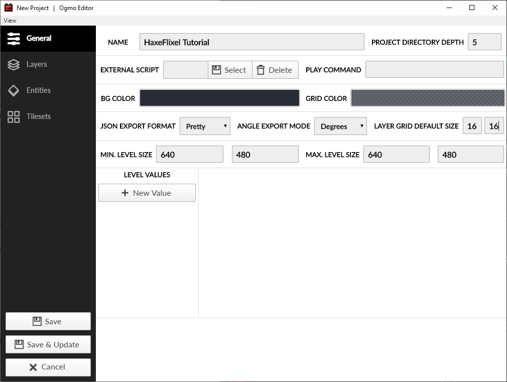
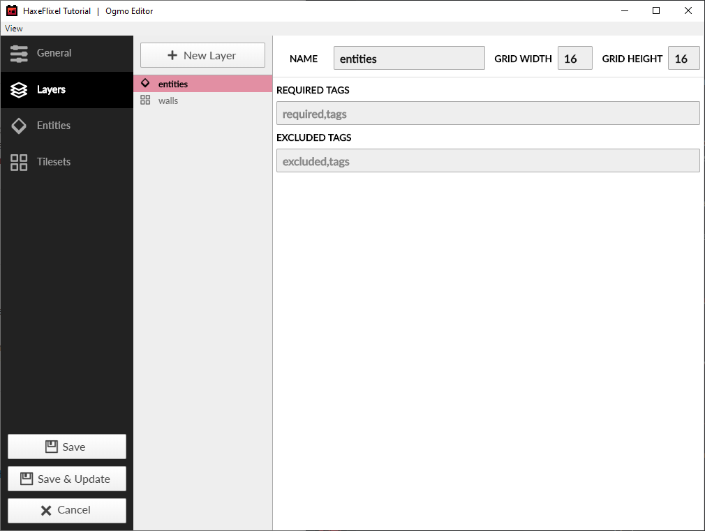
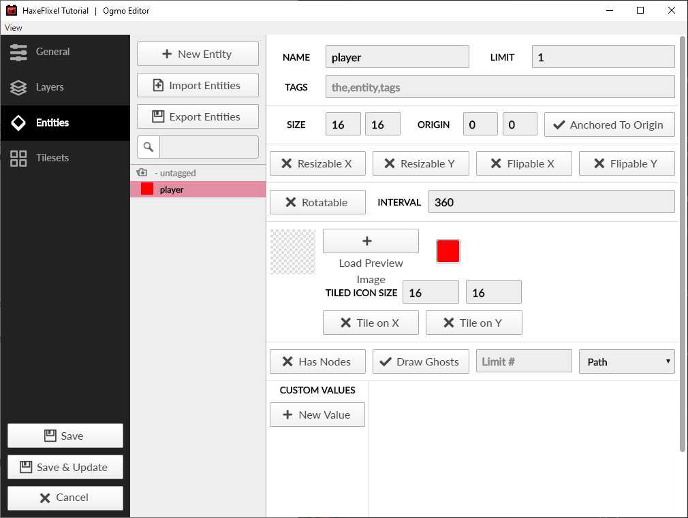
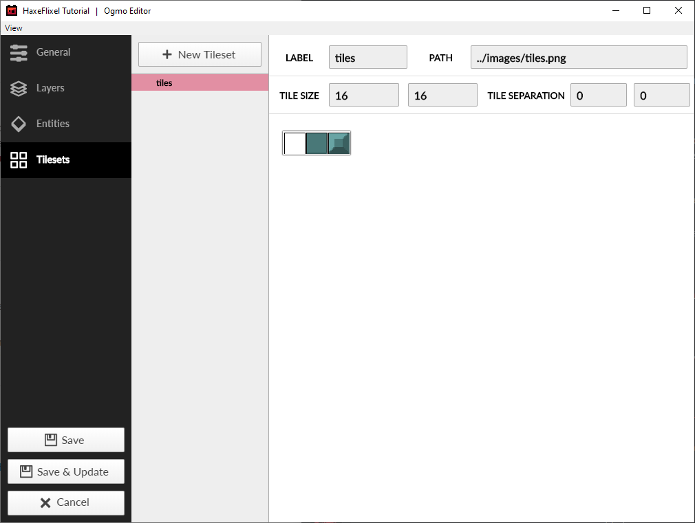
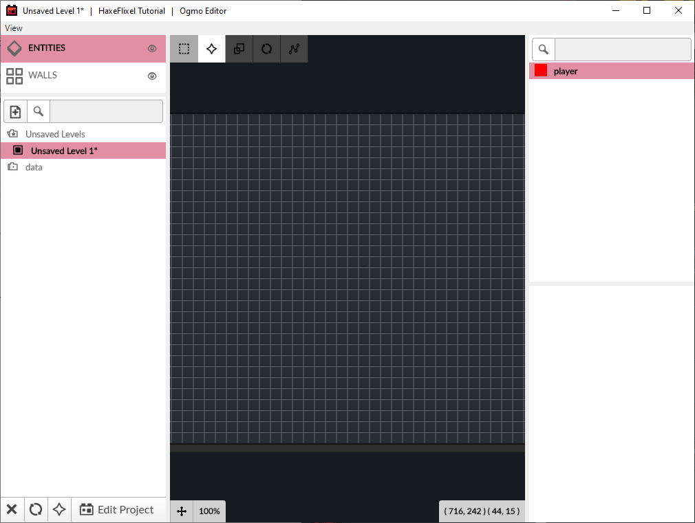
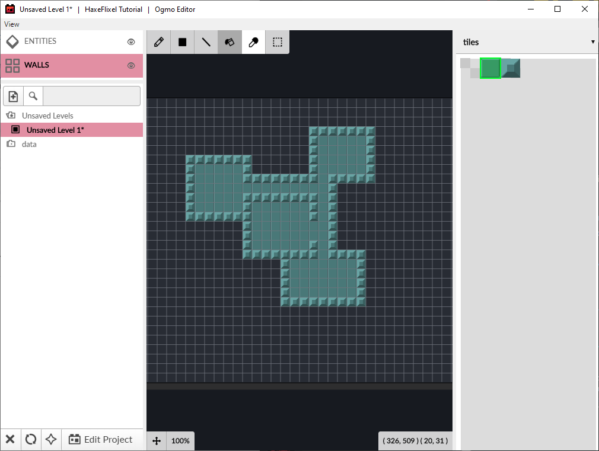
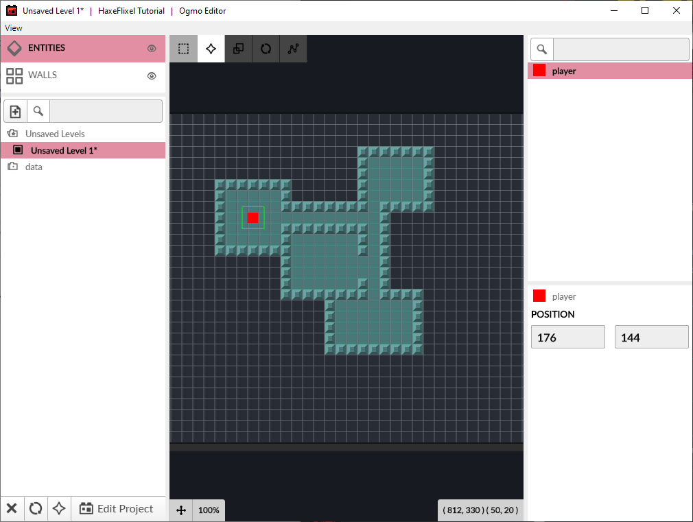

Now it's time to make some maps for the player to move around in! To do this, we're going to use a tool called _Ogmo Editor_. Ogmo is a free tilemap editor that works very nicely with HaxeFlixel. For this part of the tutorial, we're just going to use a simple 2-tile tilesheet with a tile for walls and a tile for floors.

You can make your own, with 16x16 pixel tiles, or use this one:

(Note: the first tile should be empty!)

1. Download and install [Ogmo Editor 3](https://ogmo-editor-3.github.io/), then launch it.

2. Click on `New Project` and navigate to `assets/data` - save the project as `turnBasedRPG.ogmo`.

3. On the `General` tab, you can rename your project, set the default level sizes, and more. Set it up like this:

	

4. On the `Layers` tab, make an `Entity Layer` called `entities` and a `Tile Layer` called `walls`:

	

5. On the `Entities` tab, make an entity called `player`:

	

6. Finally, on the `Tilesets` tab, make a new tileset called `tiles` and load the tiles from earlier:

	

7. When you're done, click on `Save` and you'll be brought to this screen:
	
	

8. Make sure you're on the `walls` layer, and using the tools at the top, draw out a simple map. Make sure it's completely encircled by walls (so the player can't wander off the map), and make the insides filled with floor tiles. You should end up with something like this:
	
	

9. Now, switch over to the 'entities' layer, and place your player entity somewhere in one of your rooms:
	
	

10. Hit Ctrl+S (Cmd+S on Mac), and save this level as `room-001.json` in `assets/data`.

We're done with Ogmo for now, so save all your changes and exit.

In the next part, we will learn how to load the newly created tilemap into our game.