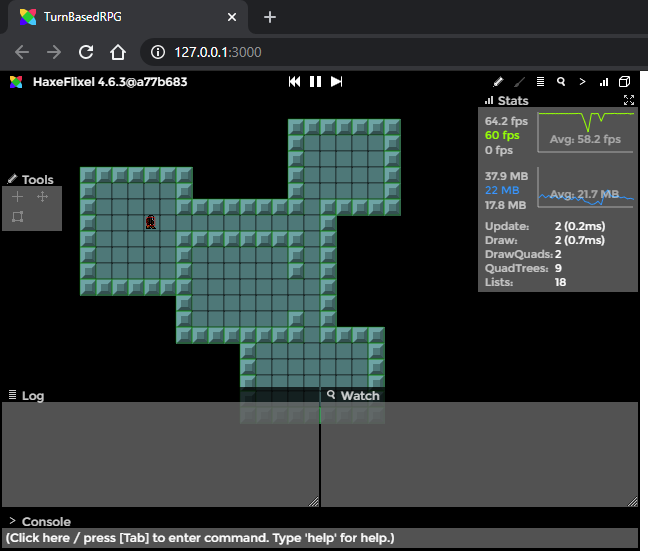

One of the great things about using Ogmo with HaxeFlixel is that there is already a built-in class to load and use the maps. However, it's not in the 'standard' HaxeFlixel library - we have to install the flixel-addons library to get access to it.

1. Open up a new command prompt and enter:
	
	```bash
	haxelib install flixel-addons
	```

	This should run and install the new library. Close the command prompt window when it's finished.
	
2. Jump back into VSCode and open up your `Project.xml` file. We need to tell our project to include flixel-addons in the libraries.

3. Look for a line that says:
	
	```xml
	<!--<haxelib name="flixel-addons" />-->
	```
	and change it to:
	
	```xml
	<haxelib name="flixel-addons" />
	```

	Save this change - you're now playing with flixel-addons!

4. Go back to your `PlayState`, and, underneath where the `player` variable is defined, add:
	
	```haxe
	var map:FlxOgmo3Loader;
	var walls:FlxTilemap;
	```

	We're basically just creating an object to hold our Ogmo map, and then another one to hold the `FlxTilemap` that we will generate from the Ogmo map.

5. In `create()`, before we setup the player object, add:
	
	```haxe
	map = new FlxOgmo3Loader(AssetPaths.turnBasedRPG__ogmo, AssetPaths.room_001__json);
	walls = map.loadTilemap(AssetPaths.tiles__png, "walls");
	walls.follow();
	walls.setTileProperties(1, NONE);
	walls.setTileProperties(2, ANY);
	add(walls);
	```

	This just loads our room file into our `FlxOgmo3Loader` object, generates our `FlxTilemap` from the 'walls' layer, and then sets tile 1 (our floor tile) to not collide, and tile 2 (walls) to collide from any direction. Then we add our tilemap to the state.

6. Now, we need to make our player object get placed in the right location on the map. So, change where we initialize our player from:
	
	```haxe
	player = new Player(20, 20);
	```

	to:

	```haxe
	player = new Player();
	map.loadEntities(placeEntities, "entities");
	```

	We're simply telling our `map` object to loop through all of the entities in our 'entities' layer, and call the `placeEntities()` for each one (which we're about to make now).

7. Let's make the `placeEntities()` function now. When we call `loadEntities()` on our map, it will pass the data of all of the placed entities to whatever function we want. In our function, we need to take this information and do something with it. It will look like this now:
	
	```haxe
	function placeEntities(entity:EntityData)
	{
		if (entity.name == "player")
		{
			player.setPosition(entity.x, entity.y);
		}
	}
	```

	So, if this function gets passed an entity with the name "player", it will set our player object's `x` and `y` values to the entity's `x` and `y` values.

8. Now, we want to add collisions to our state, so the player will bump into walls instead of just walking through them. So, in `update()`, after `super.update(elapsed);` add:

	```haxe
	FlxG.collide(player, walls);
	```
	
	All this does is check for overlaps between our player and the walls tilemap each `update()` call. If there are any overlaps, the objects are automatically separated from each other.

9. Finally, we want to make a small tweak to the player sprite. It's a good idea to make sure that your player has a decent chance of making it through doorways. Since by default, our player sprite is the same size as our tiles (16x16 pixels), it makes it so the player has to thread the needle to make it through 1-tile wide doorways. To remedy this, we're going to change the player sprite's size and offsets. This won't change what is actually displayed for the player's graphic, only its hitbox.

	So, in the `Player` class, in the constructor, under where we set the `drag`, add:
	
	```haxe
	setSize(8, 8);
	offset.set(4, 4);
	```

10. Since we just changed the player's hitbox, we want to visualize it! Switch to `HTML5 / Debug` in the status bar and build the project. You can now press `F2` to bring up [HaxeFlixel's powerful debugging overlay](/documentation/debugger/).

	Press the 3D-ish looking cube button in the upper right corner to render hitboxes:

	

	If you look closely, you can see that the player's is smaller than the tiles now.

In the next part, we'll talk about some small tweaks to the camera.
