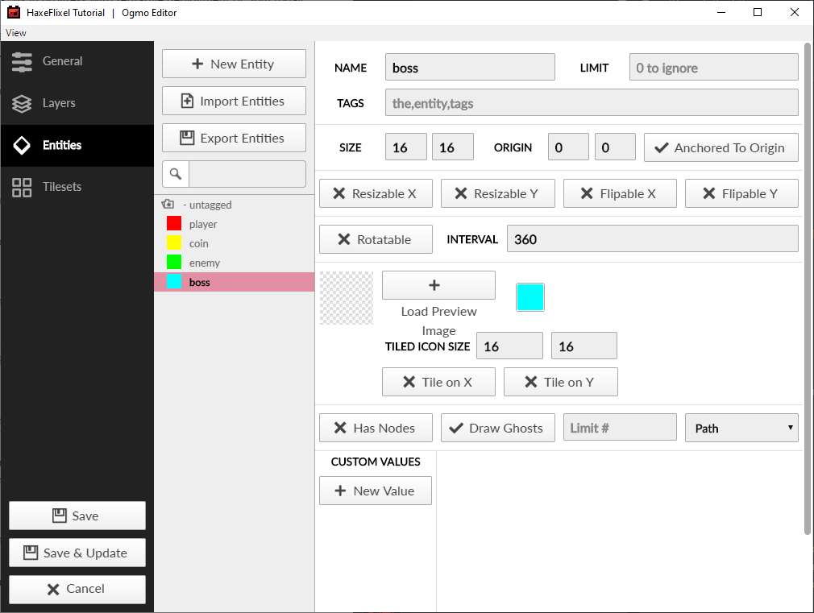
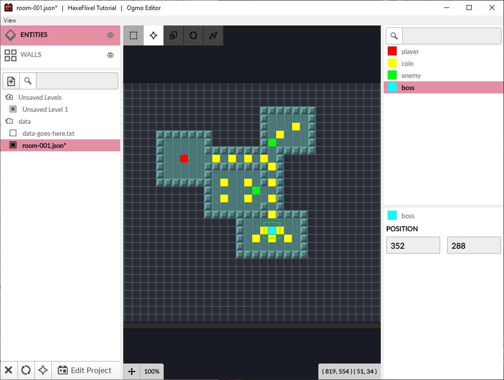
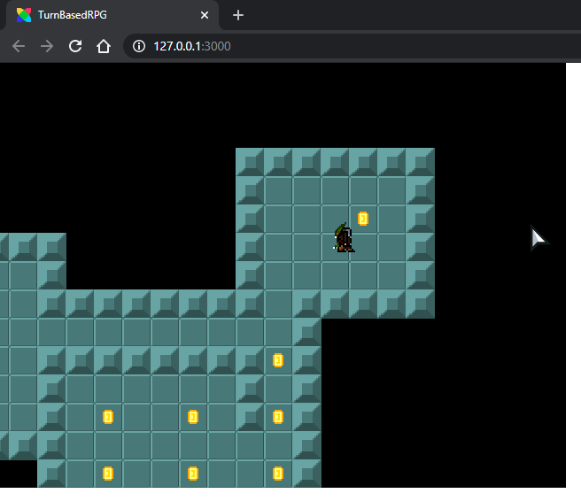

```
title: "9 - Enemies and Basic AI"
```

What would a dungeon game be without enemies? Let's add some!

1. This should be second nature by now - add two new entity types in your Ogmo project, `enemy` and `boss`:

	

2. Then scatter some enemies and a boss around the map.

	

3. So we want to have 2 different enemies in our game. We'll need spritesheets for both of them, with 16x16 pixel frames and the same animation frames as our player. Name them `enemy.png` and `boss.png` and put them in the `assets/images` folder. You can use these, if you want (thanks, again, Vicky!):

	

	

	Note: make sure that your enemy sprites are functionally the same - they should have the same number of frames for each `facing` animation.

4. Let's add a new some code for enemies. Since we're going to have two different types of enemies, regular enemies and the boss, let's start by creating an `EnemyType` enumeration:

	```haxe
	enum EnemyType
	{
		REGULAR;
		BOSS;
	}
	```

	This basically just gives us two handy constants that we can use to distuingish them. We will put both the `enum` and our `Enemy` class into the same `Enemy.hx` "module" (that's what `.hx` files are called). The class is going to look very similar to our `Player`:

	```haxe
	package;

	import flixel.FlxObject;
	import flixel.FlxSprite;

	enum EnemyType
	{
		REGULAR;
		BOSS;
	}

	class Enemy extends FlxSprite
	{
		static inline var SPEED:Float = 140;

		var type:EnemyType;

		public function new(x:Float, y:Float, type:EnemyType)
		{
			super(x, y);
			this.type = type;
			var graphic = if (type == BOSS) AssetPaths.boss__png else AssetPaths.enemy__png;
			loadGraphic(graphic, true, 16, 16);
			setFacingFlip(FlxObject.LEFT, false, false);
			setFacingFlip(FlxObject.RIGHT, true, false);
			animation.add("d", [0, 1, 0, 2], 6, false);
			animation.add("lr", [3, 4, 3, 5], 6, false);
			animation.add("u", [6, 7, 6, 8], 6, false);
			drag.x = drag.y = 10;
			width = 8;
			height = 14;
			offset.x = 4;
			offset.y = 2;
		}

		override public function update(elapsed:Float)
		{
			if ((velocity.x != 0 || velocity.y != 0) && touching == FlxObject.NONE)
			{
				if (Math.abs(velocity.x) > Math.abs(velocity.y))
				{
					if (velocity.x < 0)
						facing = FlxObject.LEFT;
					else
						facing = FlxObject.RIGHT;
				}
				else
				{
					if (velocity.y < 0)
						facing = FlxObject.UP;
					else
						facing = FlxObject.DOWN;
				}

				switch (facing)
				{
					case FlxObject.LEFT, FlxObject.RIGHT:
						animation.play("lr");

					case FlxObject.UP:
						animation.play("u");

					case FlxObject.DOWN:
						animation.play("d");
				}
			}
			super.update(elapsed);
		}
	}
	```

	The main difference is that we have a new `type` variable, which we will use to figure out which enemy sprite to load, and which one we're dealing with, etc.

5. Next, we'll make a `FlxGroup` in our `PlayState` to hold our enemies, and load them into the map, very much the same way we did our coins.

	At the top of our class, add:

	```haxe
	var enemies:FlxTypedGroup<Enemy>;
	```

	In the create function, right after we add our coin group:

	```haxe
	enemies = new FlxTypedGroup<Enemy>();
	add(enemies);
	```

	We will also need to add two more cases to our `placeEntities()` function:
	
	```haxe
	else if (entity.name == "enemy")
	{
		enemies.add(new Enemy(entity.x + 4, entity.y, REGULAR));
	}
	else if (entity.name == "boss")
	{
		enemies.add(new Enemy(entity.x + 4, entity.y, BOSS));
	}
	```

	Go ahead and test out your game to make sure the enemies are added properly.
	
6. (optional step) Our `placeEntities()` is starting to get a bit repetitive. Each `if` checks `entity.name`, and each time we use `entity.x` and `entity.y`.
	
	Let's fix this by using a `switch-case` instead of an `if`/`else`-chain, as well as adding some temporary `x` and `y` variables:

	```haxe
	var x = entity.x;
	var y = entity.y;

	switch (entity.name)
	{
		case "player":
			player.setPosition(x, y);

		case "coin":
			coins.add(new Coin(x + 4, y + 4));

		case "enemy":
			enemies.add(new Enemy(x + 4, y, REGULAR));

		case "boss":
			enemies.add(new Enemy(x + 4, y, BOSS));
	}
	```

	There, that's a lot easier to read!

Now let's give our enemies some brains.

In order to let our enemies 'think', we're going to utilize a very simple [Finite-state Machine (FSM)](http://en.wikipedia.org/wiki/Finite_state_machine). Basically, the FSM works by saying that a given machine (or entity) can only be in one state at a time. For our enemies, we're going to give them 2 possible states: `Idle` and `Chase`. When they can't 'see' the player, they will be `Idle` - wandering around aimlessly. Once the player is in view, however, they will switch to the `Chase` state and run towards the player.

1. Shouldn't be that hard! First, we'll make our `FSM` class:

	```haxe
	class FSM
	{
		public var activeState:Float->Void;

		public function new(initialState:Float->Void)
		{
			activeState = initialState;
		}

		public function update(elapsed:Float)
		{
			activeState(elapsed);
		}
	}
	```

2. Next, we'll change our `Enemy` class a little.

	We need to define these variables at the top of the class:

	```haxe
	var brain:FSM;
	var idleTimer:Float;
	var moveDirection:Float;
	public var seesPlayer:Bool;
	public var playerPosition:FlxPoint;
	```

3. At the end of the constructor, add:

	```haxe
	brain = new FSM(idle);
	idleTimer = 0;
	playerPosition = FlxPoint.get();
	```

4. And then add the following functions:

	```haxe
	function idle(elapsed:Float)
	{
		if (seesPlayer)
		{
			brain.activeState = chase;
		}
		else if (idleTimer <= 0)
		{
			if (FlxG.random.bool(1))
			{
				moveDirection = -1;
				velocity.x = velocity.y = 0;
			}
			else
			{
				moveDirection = FlxG.random.int(0, 8) * 45;
				
				velocity.set(SPEED * 0.5, 0);
				velocity.rotate(FlxPoint.weak(), moveDirection);
				
			}
			idleTimer = FlxG.random.int(1, 4);			
		}
		else
			idleTimer -= elapsed;
		
	}

	function chase(elapsed:Float)
	{
		if (!seesPlayer)
		{
			brain.activeState = idle;
		}
		else
		{
			FlxVelocity.moveTowardsPoint(this, playerPosition, Std.int(SPEED));
		}
	}
	```

	Also add this line to `update()` before `super.elapsed()`:

	```haxe
	brain.update(elapsed);
	```

	The way this is going to work is that each enemy will start in the `Idle` state. In the `PlayState` we will have each enemy check to see if it can see the player or not. If it can, it will switch to the `Chase` state, until it can't see the player anymore. While in the `Idle` state, every so often (in random intervals) it will choose a random direction to move in for a little while (with a small chance to just stand still). While in the `Chase` state, they will move directly towards the player.

5. Let's jump over to the `PlayState` to add our player's vision logic. In `update()`, under the overlap and collision checks, add:

	```haxe
	FlxG.collide(enemies, walls);
	enemies.forEachAlive(checkEnemyVision);
	```

6. Next, add the `checkEnemyVision()` function:

	```haxe
	function checkEnemyVision(enemy:Enemy)
	{
		if (walls.ray(enemy.getMidpoint(), player.getMidpoint()))
		{
			enemy.seesPlayer = true;
			enemy.playerPosition.copyFrom(player.getMidpoint());
		}
		else
		{
			enemy.seesPlayer = false;
		}
	}
	```

That's all there is to it! Try out your game and make sure it works.



Next, we'll add some UI to the game, and add our RPG-style combat so you can fight the enemies!
