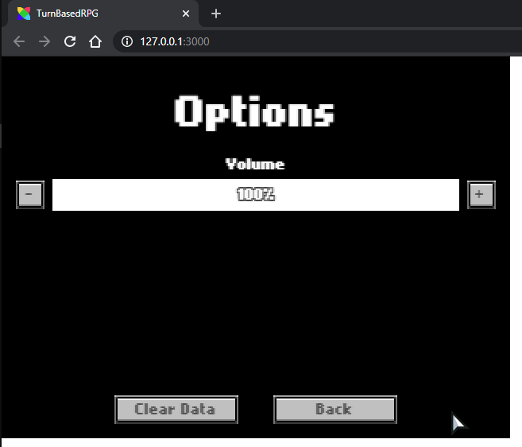

Our game is really starting to come together! Now we need it to feel more like a 'game' with a win and lose scenario. For our (very simple) game, we'll just make it so that if you ever die in combat, you get a Game Over, and when you beat the boss enemy, you win. Both of these conditions will take you to the same `FlxState` to show you your score and allow you to play again if you want.

1. Let's start with `PlayState`. We need to add some flags to see if we're ending the game, and if the player has 'won' or not. So, add:
	
	```haxe
	var ending:Bool;
	var won:Bool;
	```

	To the top of the class.

2. Next, in `update()`, right under `super.update(elapsed)` add:

	```haxe
	if (ending)
	{
		return;
	}
	```

	We don't want to allow anything else to go on if we're ending the game and getting ready to switch states.

3. Next, still in `update()`, we're going to change our logic in `if (inCombat)` to this:

	```haxe
	if (!combatHud.visible)
	{
		health = combatHud.playerHealth;
		hud.updateHUD(health, money);
		if (combatHud.outcome == DEFEAT)
		{
			ending = true;
			FlxG.camera.fade(FlxColor.BLACK, 0.33, false, doneFadeOut);
		}
		else
		{
			if (combatHud.outcome == VICTORY)
			{
				combatHud.enemy.kill();
				if (combatHud.enemy.type == BOSS)
				{
					won = true;
					ending = true;
					FlxG.camera.fade(FlxColor.BLACK, 0.33, false, doneFadeOut);
				}
			}
			else
			{
				combatHud.enemy.flicker();
			}
			inCombat = false;
			player.active = true;
			enemies.active = true;
		}
	}
	```

	This will now check to see if the outcome was `DEFEAT`, and if it was, it will set our ending flag to true, and then tell the camera to start fading out - calling `doneFadeOut()` when it's done.

	Similarly, if the outcome was `VICTORY`, and the enemy that was just defeated was type 1 (the boss), we set our `won` flag to `true`, and also start fading out.

4. When the camera is done fading to black, we call this function, which will switch the state to our `GameOverState` (which you'll make in a second), passing it if the player won or not, and how much money they have.

	```haxe
	function doneFadeOut()
	{
		FlxG.switchState(new GameOverState(won, money));
	}
	```

5. Finally, we need to add the `GameOverState`. This is going to be a pretty simple `FlxState` where we show a message - either "Game Over" or "You Win!", depending on our won flag, and the final score for this player. We will also use flixel's save/load functionality to compare the previous highscores, and, if the new score is higher, replace the saved highscore, and show the highscore on the screen.

	Finally, we have a button to take the player back to the main menu.

	Here is the code for that State:

	[GameOverState.hx](https://github.com/HaxeFlixel/flixel-demos/blob/master/Tutorials/TurnBasedRPG/source/GameOverState.hx)

If you test your game, you should be able to trigger the `GameOverState` by either dying in combat or defeating the boss, and then clicking on the button in the `GameOverState` will take you back to our `MenuState` so you can play again. If all of that works, you're on the right track! But… our `MenuState` is looking a little bland, now… let's fix that up!

[](../images/01_tutorial/0021.png)

1. Let's add a title and an options-button to the `MenuState`:

	```haxe
	var titleText:FlxText;
	var optionsButton:FlxButton;
	```

2. Then, in `create()`, we'll add them to the state (and move the play-button as well):

	```haxe
	titleText = new FlxText(20, 0, 0, "HaxeFlixel\nTutorial\nGame", 22);
	titleText.alignment = CENTER;
	titleText.screenCenter(X);
	add(titleText);
	
	playButton = new FlxButton(0, 0, "Play", clickPlay);
	playButton.x = (FlxG.width / 2) - playButton.width - 10;
	playButton.y = FlxG.height - playButton.height - 10;
	add(playButton);
	
	optionsButton = new FlxButton(0, 0, "Options", clickOptions);
	optionsButton.x = (FlxG.width / 2) + 10;
	optionsButton.y = FlxG.height - optionsButton.height - 10;
	add(optionsButton);
	```

3. Add the function that gets called when the options-button is clicked:

	```haxe
	function clickOptions()
	{
		FlxG.switchState(new OptionsState());
	}
	```

4. The `OptionsState` that is called from the options button is fairly simple. It will contain a button to allow the user to clear the saved data (highscores, etc), as well as a simple `FlxBar` to show the user the current volume level of the game with buttons to adjust it up or down. It will save the volume values so that each time the game starts, it will 'remember' what volume it was last set to (I know there's no sound…. yet ;))

	The code for this State looks like this:

	[OptionsState.hx](https://github.com/HaxeFlixel/flixel-demos/blob/master/Tutorials/TurnBasedRPG/source/OptionsState.hx)

	The `OptionsState` class uses a different spritesheet for the volume adjustment buttons (because they should appear smaller than the default buttons). This asset must have 3 frames, one to represent each button state: `NORMAL`, `HIGHLIGHT`, and `PRESSED`. As long as we set up the frames in that order, the `FlxButton` class will handle the rest.

	Once again, you can make your own, or use the image below. Place it in the `assets/images` folder, and you should be all set.

	

	Finally, we want our game to load the stored volume (if there is any) each time the game starts, so, go to `Main.hx`, and add this after the `addChild()` call:

	```haxe
	var save = new FlxSave();
	save.bind("TurnBasedRPG");
	if (save.data.volume != null)
	{
		FlxG.sound.volume = save.data.volume;
	}
	save.close();
	```

	Pretty simple: it makes a new `FlxSave` object, binds it to our `"TurnBasedRPG"` and then checks if there is a volume value stored in it, and if there is, sets our game's volume to match, and then closes the save.

Test everything out, make sure it's working, and that if you change your volume under options and then exit the game, it retains the value the next time to get into the options screen.



Looking good! Next time we'll give our volume something to do by adding sound and music!
