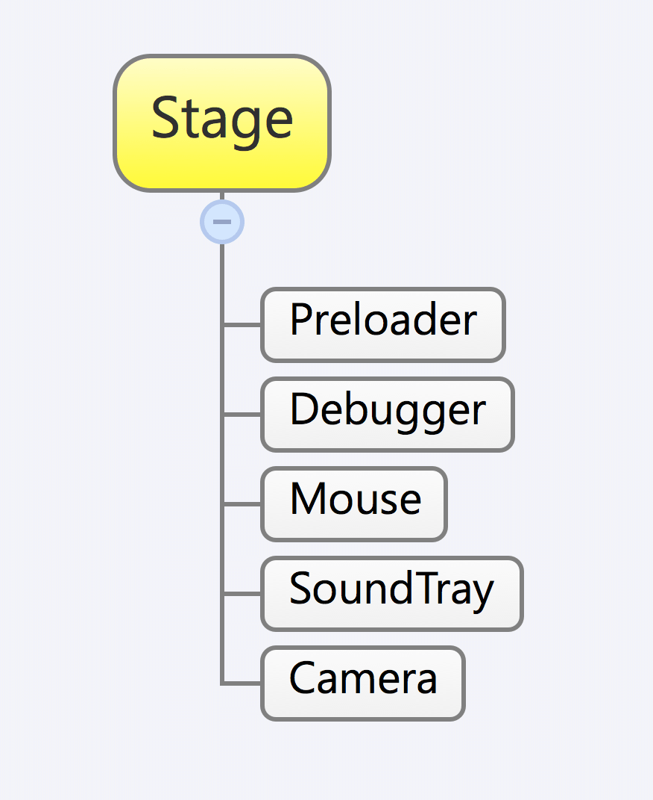

```
title: "Flixel Display List"
```
The Flixel Display list is a specially designed structure for your game's sprites to be rendered.

#### `FlxSprite` != `flash.display.Sprite`

The Flash API has a [display list](http://help.adobe.com/en_US/as3/dev/WS5b3ccc516d4fbf351e63e3d118a9b90204-7e58.html) that is populated by adding [display objects](http://help.adobe.com/en_US/FlashPlatform/reference/actionscript/3/flash/display/DisplayObject.html) in a parent child relationship. `Sprite`s are an extended form of display objects that have extended features. They can be added, removed and can have their parent and children's depth changed with an easy to use API.

It is a common misconception for Flash developers to assume that `FlxSprite`s in Flixel work like the Flash `Sprite`s. `FlxSprite`s also do not share the event system Flash `Sprite`s have, so `addEventListener()` is also not available or necessary in most situations.

For performance reasons, Flixel has its own independent display list and it renders all of its `FlxSprite`s onto a single Flash `DisplayObject` with each `FlxCamera`. For this reason, you cannot add a `flash.display.sprite` to a `FlxState` and you cannot add a `FlxSprite` to the main Flash stage.

You can see the display objects used in a typical Flixel game in this diagram. Note you can still place display objects above or below Flixel's camera. It it recommended to use `FlxG.addChildBelowMouse()` and `FlxG.removeChild()` for that.


