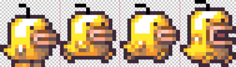

```
title: "FlxSprite"
apiPath: FlxSprite.html
```

```haxe
import flixel.FlxSprite;
```

FlxSprites are the core building blocks of all Flixel games. They offer a friendly API to add animation, movement and features for the needs of most games.

It is pretty common place to extend `FlxSprite` for your own game's needs; for example a `SpaceShip` class may extend `FlxSprite` but could have additional variables for the game like `shieldStrength` or `shieldPower`. When you extend `FlxSprite` it is important to remember to use `super.update()` if you override the `update` method, as you would do for any other `FlxBasic`.

#### loadGraphic()

This method is the easiest way to use a single image for your FlxSprite. Using the OpenFL asset system defined in the project xml file you simply have to define a path to your image and the compiler will do the rest.

```haxe
var player = new FlxSprite();
player.loadGraphic("assets/player.png");
add(player);
```

#### makeGraphic()

This method is a handy way to make a simple color fill to quickly test a feature or have the basic shape.

```haxe
var whiteSquare = new FlxSprite();
whiteSquare.makeGraphic(200, 200, FlxColor.WHITE);
add(whiteSquare);
```

### Properties

#### Position: x, y
```haxe
whiteSquare.x = 100;
whiteSquare.y = 300;
```

#### Size: width, height

Automatically set in `loadGraphic()` or `makeGraphic()`, changing this will only affect the hitbox of this sprite, use `scale` to change the graphic's size.
```haxe
// get
var getWidth = whiteSquare.width;

// set
whiteSquare.width = 100;
whiteSquare.height = 100;
```

#### Scale
**(FlxPoint)**
Change the size of your sprite's graphic. *NOTE: The hitbox is not automatically adjusted, use `updateHitbox()` for that (or `setGraphicSize()`).*
```haxe
// twice as big
whiteSquare.scale.set(2, 2);

// 50%
whiteSquare.scale.set(0.5, 0.5);
```

#### Offset
**(FlxPoint)**
Controls the position of the sprite's hitbox. Likely needs to be adjusted after changing a sprite's width, height or scale.
```haxe
whiteSquare.offset.set(50, 50);
```

#### Origin
**(FlxPoint)**
Rotation axis. **Default: center.**

*WARNING: If you change this, the visuals and the collisions will likely be pretty out-of-sync if you do any rotation.*
```haxe
// rotate from top-left corner instead of center
whiteSquare.origin.set(0, 0);
```

#### ​kill()

This method is useful for when you want to hide a sprite from the stage but keep it available to reuse later. For example you may want to respawn an enemy the player has killed.

#### destroy()

This method is destructive to the sprite and should be used when you want to make sure that the sprite will be cleared from memory. It is commonly used inside a FlxState's overridden destroy method.

### Animation

Flixel supports spritesheet animation.



```haxe
player.loadGraphic("assets/player.png", true, 32, 36);
player.animation.add("walk", [0, 1, 0, 2], 5, true);
player.animation.play("walk");
```
