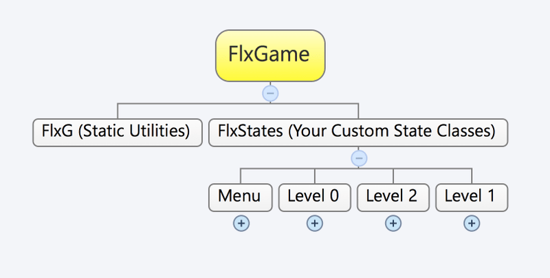
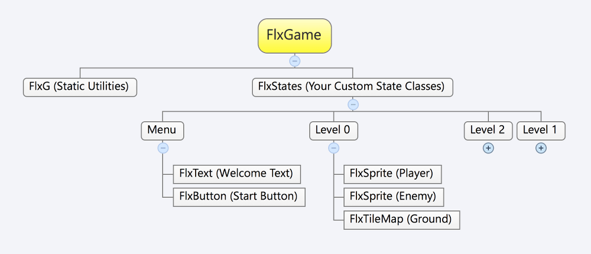

```
title: "FlxState"
apiPath: FlxState.html
```

This is the basis for your game's levels and menus, each described in a "state" structure. The state is a way of organising your game objects for the state that the game is currently in. For example, when you create level 0 of your game it's much more organized to only have the code for that level, not every level. Also it's good to use switching states to clear your memory, to avoid memory leaks. A typical Flixel game will have a separate FlxState class for every level and menu.



In each `FlxState` all the FlxSprites are added to be rendered.



### Important Methods

#### create()

This is where you setup and create all your state's objects; for example your level tilemaps, your player sprites, spawn your initial enemies. Flixel runs this method before it starts to render your state so its the perfect place.

#### add(object:FlxBasic)

This is the place where you add your sprites, tilemaps etc to your state to be rendered. It works similar to the NME display list api addChild().

#### remove(object:FlxBasic)

This is the place where you remove sprites etc you have added to your state. Everything you remove still exists so you can add it back later. If you're not going to use the removed object again you might want to consider removing it from memory by setting it as null for example.

#### update()

This is the place where you can run code on every frame of your game. It's where you setup your input controls, trigger movement and almost all of your gameplay logic.

#### destroy()

This is a common method throughout Flixel that ensures that you remove objects from the memory. If you don't properly destroy your objects in your states the objects may not be cleaned up by the garbage collection and consume memory over time.

``` haxe
package;

import flixel.FlxState;

class FlxExampleState extends FlxState
{
	override public function create():Void
	{
		//create your state objects here
	}

	override public function update():Void
	{
		//call super to update the core state class
		super.update();
	}

	override public function destroy():Void
	{
		//call super to destroy the core state class objects
		super.destroy();
	}
}
```

Here is an example of a simple game state;

``` haxe
package;

import flixel.tile.FlxTilemap;
import flixel.FlxObject;
import flixel.FlxG;
import flixel.FlxSprite;
import flixel.FlxState;

class FlxExampleState extends FlxState
{
	private var wizard:FlxSprite;
	private var level:FlxTilemap;

	override public function create():Void
	{
		//create a main player
		wizard = new FlxSprite(200, 200,'assets/player.png');
		wizard.maxVelocity.set(80, 200);
		wizard.acceleration.y = 200; // gravity
		wizard.drag.x = wizard.maxVelocity.x * 4;
		add(wizard);

		//create a tilemap level
		level = new FlxTilemap();
		level.loadMap('assets/level.csv', FlxTilemap.imgAuto, 0, 0, FlxTilemap.AUTO);
		add(level);
	}

	override public function update():Void
	{
		//control the player with keyboard
		wizard.acceleration.x = 0;

		if (FlxG.keys.LEFT)
		{
			wizard.acceleration.x = -wizard.maxVelocity.x * 4;
		}
		if (FlxG.keys.RIGHT)
		{
			wizard.acceleration.x = wizard.maxVelocity.x * 4;
		}
		if (FlxG.keys.SPACE && player.isTouching(FlxObject.FLOOR))
		{
				wizard.velocity.y = -wizard.maxVelocity.y / 2;
		}
		super.update();
	}

	override public function destroy():Void
	{
		//destroy for garbage collection when you switch state
		wizard.destroy();
		wizard = null;

		level.destroy();
		level = null;

		super.destroy();
	}
}
```

 
