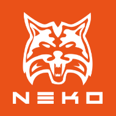

```
title: "Neko"
```



[Neko](http://nekovm.org/) is a high-level dynamically typed programming language and virtual machine. Neko as a target of HaxeFlixel and OpenFL supports an API close to the CPP builds of HaxeFlixel.

The NekoVM itself is part of the [Haxe Toolkit](http://haxe.org/doc/start/neko) and is used throughout Haxelib, Lime, OpenFL and flixel-tools to easily create cross-platform tools. Neko gives the power of the Haxe standard library to cross platform development tools.

Neko itself is also used server-side in [websites](https://github.com/ufront) and general backend systems like the Haxelib. It contains a fully featured threading and socket API as well as integration with the [Apache server](http://haxe.org/doc/build/mod_neko).

[Joshua Granick](http://www.joshuagranick.com/blog/):

> "When NME (Now known as Lime/OpenFL) was first created, it was designed to provide graphics, sound and other media for the NekoVM, but since the performance was not yet ideal, Hugh then decided (if I have my order of events correct) to experiment with a C++ target for Haxe. It worked, and HXCPP was born."

Its advantages:
- Extremely fast compilation time that can run on Linux, Mac or Windows.
- Since it uses almost the same API as the CPP builds, it is a quicker way to test.
  When you test with Flash it will use a much different part of the Haxe API.

Its disadvantages:
- Being a virtual machine, it is does not perform as well as a native build using the SDL builds of Lime. 
  Performance can be close to the Flash Player depending on the context.

### Conditionals

```
#if neko
//your neko code
#end

#if desktop
//your neko code
#end
```

#### Command line

The basic command to compile and test the Neko target:

```
lime test neko
```
