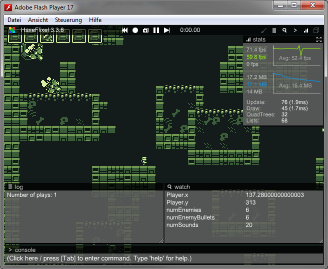
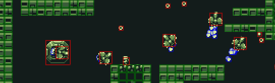
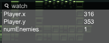
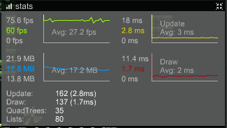
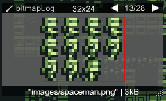
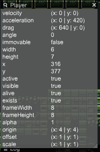
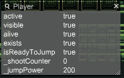
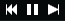
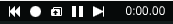
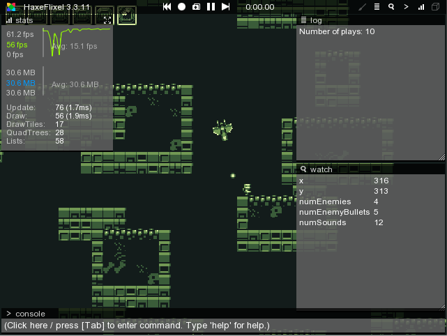

```
title: "Debugger"
```

Flixel comes with a fairly powerful debugging overlay. You can open it with one of the two default toggle keys (\` and \ with a QWERTY keyboard layout). Note that these are configurable via `FlxG.debugger.toggleKeys`. Alternatively, you can do the same in code via the `FlxG.debugger.visible` flag.

Note that the debugger does not exist when compiling with `FLX_NO_DEBUG`. With the default `Project.xml`, this is the case in release mode.



## Debug draw

`FlxG.debugger.drawDebug` can be enabled to display the hitboxes of every `FlxObject` added to the state (alternatively, press the cube button in the upper right corner of the debugger).



The hitboxes are color-coded based on the collision properties. For `FlxObject` and `FlxSprite` this means:

- Blue for `allowCollisions == FlxObject.NONE`
- Green for `immovable` objects
- Red otherwise

The color is customizable via the `debugBoundingBoxColor` property.

The behavior of tiles in `FlxTilemap` is slightly different:

- Blue for `allowCollisions == FlxObject.NONE`
- Green for `allowCollisions == FlxObject.ANY`
- Pink for other values of `allowCollisions`

## The Log Window

The log window is used to display traces and can be accessed via `FlxG.log`. You can also redirect any `trace()`-calls to it with `FlxG.log.redirectTraces = true;`. Using it is mostly a matter of preference, some people prefer to have their traces displayed in their IDE of choice (FlashDevelop's output panel for example).

Some flixel-internal errors will also be output to the log window.

### Log styles

It's possible to customize things like text color, size, style or add a prefix by using log styles. `FlxG.log.warn()`, `error()` and `notice()` use pre-defined log styles.

Here's an example of how you could differentiate each trace by the player from others by adding a `[Player]` prefix and printing it in green:

```haxe
var playerAction = new LogStyle("[Player]", "00FF40");
FlxG.log.advanced(" Shoot", playerAction);
```

## The Watch Window

It's very common to use `trace()`-calls to output the value of certain variables for debugging. However, this approach doesn't scale very well - at 60 fps, tracing the values of multiple variables results in a flood of messages. Breakpoints-debugging is great to inspect a game's internal state, but doesn't help when interrupting the execution is not an option, for example when debugging input logic.

This is where the watch window comes into play. It displays the values of variables using reflection. For example, to keep track of the player's position:

```haxe
FlxG.watch.add(_player, "x");
FlxG.watch.add(_player, "y");
```

The display string does not have to be the same as the variable's name, "numEnemies" is much more descriptive than "length" in this example:

```haxe
FlxG.watch.add(_enemies, "length", "numEnemies");
```



For static variables, you pass the class instead of an object:

```haxe
FlxG.watch.add(FlxG, "height");
```

It's also possible to edit the displayed values by clicking on them, entering a new value in the text field and pressing enter to confirm. This even works with `FlxPoint` objects.

To remove a watch entry again, simply call `FlxG.watch.remove(object, variableName)`.

### Quick watches

Quick watches are a lightweight alternative to a regular watch entry. They don't require a variable, they simply store a value for a `String` name. The following example stores the result of `FlxG.keys.anyPressed(["UP", "W"])` under the name `"Up key pressed"` - this is updated every frame since it happens in `update()`.

```haxe
override public function update():Void
{
	super.update();
	FlxG.watch.addQuick("Up key pressed", FlxG.keys.anyPressed(["UP", "W"]));
}
```

To remove a quick watch entry, call `FlxG.watch.removeQuick(name)`.
Quick watch values can not be modified.

### Mouse watch

`FlxG.watch.addMouse()` is a convenient helper to display the current mouse position in the watch window. This can be useful to find the right coordinates to position UI elements at. You can also use the console command `watchMouse` to call this function.

## The Stats Window

The stats window displays some basic profiling info:

1. FPS value
2. Memory usage in MB
3. The amount of `update()` calls this frame (and the time it took in ms)
4. The amount of `draw()` calls this frame (and the time it took in ms)
5. The size of the `FlxQuadtree` pool for collision detection
6. The size of the `FlxList` (used for quad trees) pool

3 and 4 are especially useful when it comes to performance optimization ("Do I need to optimize my rendering or my update-logic?"). Of course this is only very basic data, profiling tools like [Adobe Scout](https://creative.adobe.com/products/scout) or [hxScout](http://hxscout.com) provide much more detailed information.



## The Bitmap Log Window

The Bitmap Log can be used to display `BitmapData` objects via `FlxG.bitmapLog.add(bitmapData)`. This can be useful to debug logic that manipulates some `BitmapData`. The window provides a slideshow to scroll through logged bitmaps. You can use the middle mouse button to move the graphic around and the mouse wheel to zoom in and out.

You can also inspect flixel's internal `BitmapData` cache by calling `FlxG.bitmapLog.viewCache()` or entering the console command `viewCache`.



## The Console Window

The console allows a limited subset of Haxe code to be parsed and executed at runtime via [hscript](https://github.com/HaxeFoundation/hscript) via reflection. Commands like `state._player.x = 50` or `state._player.jump()` as you'd expect. Especially on targets with long compile times, this can speed up development substantially.

`state` is the starting point for hscript and needs to be registered to the console to be available - Flixel already does this for you. The same goes for a few classes like `FlxG` or `Math`. To register further objects or classes, call `FlxG.console.registerObject()`.

By default, the game is paused when the console text field receives focus. After a command is executed, the game progresses one frame so the effects can be seen.

The console stores executed commands (use the up and down keys to cycle through them). This history is persistent across executions of your game (but not across different target platforms).

### Addings custom commands

Functions can also be registered to the console directly as commands via `FlxG.console.registerFunction()`. Here's an example with a function called `"spawnEnemy"`, spawning a new enemy at the current mouse position in the Mode demo.

```haxe
// in PlayState#create()
FlxG.console.addCommand("spawnEnemy", function() {
	var mousePos = FlxG.mouse.getWorldPosition();
	var enemy = _enemies.recycle(Enemy);
	enemy.init(Std.int(mousePos.x), Std.int(mousePos.y), _enemyBullets, _bigGibs, _player);
});
```

## Tracker Windows

Tracker windows are a convenient way to inspect the most important properties of a class / object. Each tracker window is basically a watch window instance. It's the only window type that can be closed.

A _tracker profile_ defines the properties that should be watched for a specific class. Let's take a look at the pre-defined tracker profile for `FlxSprite`:

```haxe
new TrackerProfile(FlxSprite, ["frameWidth", "frameHeight", "alpha", "origin", "offset", "scale"], [FlxObject])
```

The first argument determines the class the profile belongs to, the second is an `Array<String>` containing the property names. The third argument is a list of extensions - in this case just `FlxObject`. This means that the properties defined in the tracker profile of `FlxObject` will be added to tracker windows for `FlxSprite` as well. This works recursively - `FlxObject` "extends" the `FlxBasic` tracker profile, so any properties of that profile will be added as well. This is why `FlxG.debugger.track(_player)` in Mode's `PlayState#create()` creates a window with a longer list of properties than you'd initially expect from the `FlxSprite` profile:



Alternatively, you can use the console to create tracker windows at runtime:

`track(FlxG.state._player)`

The real power of tracker windows comes with the ability to define custom profiles, for example for the `Player` class in Mode:

```haxe
FlxG.debugger.addTrackerProfile(new TrackerProfile(Player, ["isReadyToJump", "_shootCounter", "_jumpPower"], [FlxBasic]));
```

(Note: calling `addTrackerProfile()` causes a crash on the latest haxelib release due to a bug. As a workaround, you can call `FlxG.debugger.track(null);` beforehand).



## The VCR

Flixel's VCR feature (recording and replaying via `FlxG.vcr`) is mostly disabled by default and can be activated with the `FLX_RECORD` define. Even so, a few features are still available by default via the middle three buttons of the debugger:



The left button resets the current state via `FlxG.resetState()`.

The middle button pauses / unpauses the game.

The right button pauses the game if it isn't already paused and skips ahead exactly one frame (one `update()` and one `draw()` call). This can be very useful for debugging certain issues.

If `FLX_RECORD` is defined, two more buttons are available:



The circle starts a new recording - it also resets the current state, since the VCR does not support recordings that start mid-state. If a recording has already been started, the button stops it and opens a file dialog to save it.

The button with the folder icon right allows loading record files and replaying them.

## Adding Debugger Buttons

You can add custom buttons to the debugger header using `FlxG.debugger.addButton()`. This is what `FlxNapeState` from flixel-addons does if you use it - it adds a convenient "N" button to toggle Nape's debug draw.


Debugger buttons are persistent across states - `FlxG.debugger.removeButton()` has to be called manually to remove state-specific buttons.

## Debugger Layouts

A debugger layout determines the initial position and size of each debugger window. The available layouts are described in the [DebuggerLayout](http://api.haxeflixel.com/flixel/system/debug/DebuggerLayout.html) enum. You can change the current layout by calling `FlxG.debugger.setLayout()`.

Here's an example of `DebuggerLayout.RIGHT`:


