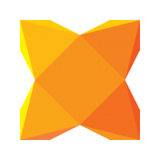

```
title: "Introduction to Haxe"
```
Haxe is a cross-platform toolkit for developing applications, games, multimedia and server side code natively. Cross-compiling your code offers longevity to your code base that is not possible for other methods of cross-platform development.

The Haxe programming language itself is High Level and Strictly Typed. It allows for Object Orientated programming with similar to syntax in AS3 and Java. Haxe is often learnt quickly and loved by developers coming from similar languages. Haxe is a valuable language to learn not only for games, but server-side development, command line tools and various other technologies.

Haxe is an open source technology, free to use and modify. The Haxe toolkit provides a powerful cross-platform standard library that lets your code solve problems and have a codebase that is more versatile.

Backed by the [Haxe Foundation](http://haxe.org/foundation), industry sponsors and partners, it receives enterprise support and is sponsored and recognized by developers at a growing number of large companies such as Nickelodeon, Disney, TiVo, Prezi, Stencyl and more. The Haxe Foundation directs long term initiatives for Haxe and officially sponsors the [Open Flash Library](http://www.openfl.org) that HaxeFlixel also leverages.

Haxe has an active Google community page and IRC channel:

*   https://groups.google.com/forum/#!forum/haxelang
*   IRC channel #haxe on freenode.

Haxe is being developed through GitHub:

*   https://github.com/HaxeFoundation

[](http://haxe.org)
