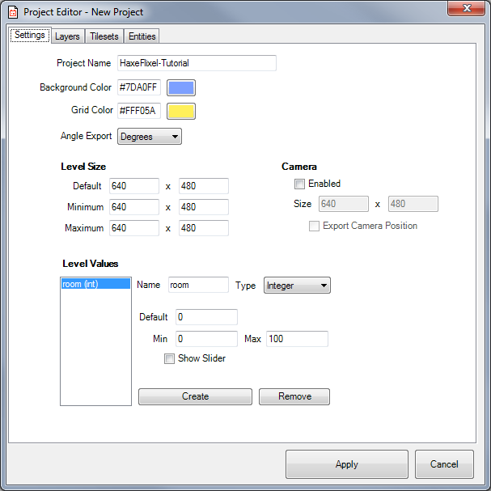
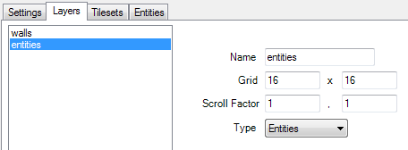
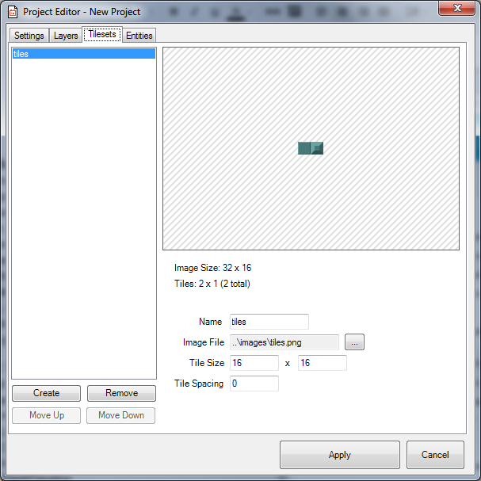
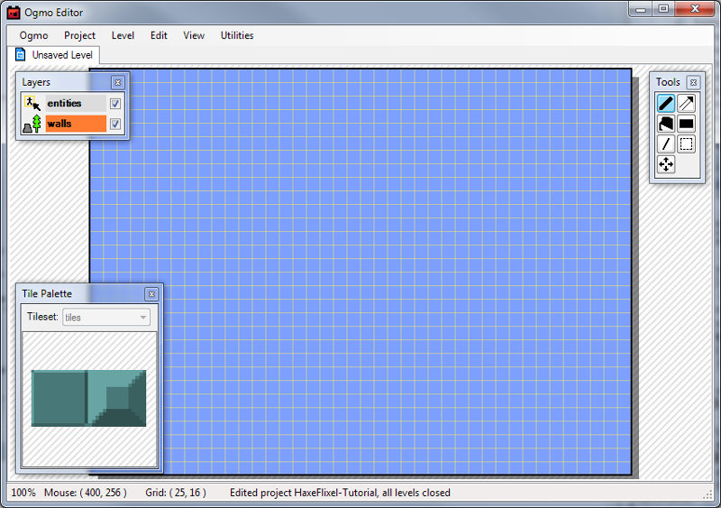
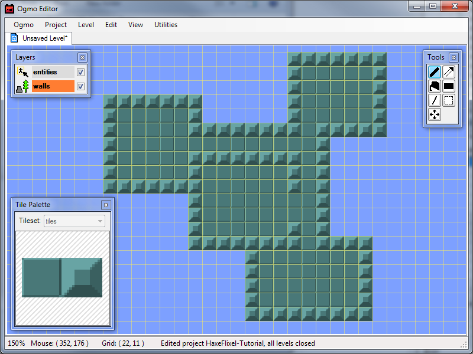
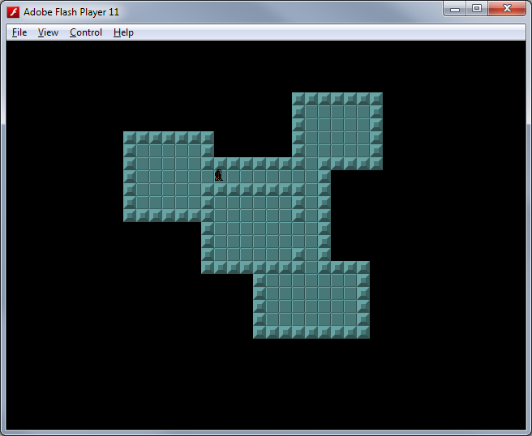

```
title: "Part V: Tiles, Maps, and Collisions"
```

Now it's time to make some maps for the player to move around in! To do this, we're going to use a tool called Ogmo Editor. Ogmo is a free tile map editor that works very nicely with HaxeFlixel. For this part of the tutorial, we're just going to use a simple 2-tile Tilesheet with a tile for Walls and a tile for Floors.

You can make your own, with 16x16 pixel tiles, or use this one:


(Note: the first tile should be empty!)

1. Go to [http://www.ogmoeditor.com](http://www.ogmoeditor.com/) to download and install it, then launch the editor.

2. Go to Project > New Project and name your project whatever you want. I would save it under assets/data.

3. Next, you need to define your project's settings. Go through each tab, one-by-one, and set it up to look like the following:

	

	

	

	

	

4. Hit Apply to save your changes. You should now see a screen that looks like this:
	
	

5. Make sure you're on the 'walls' layer, and, using tools on the right, draw out a simple map. Make sure it's completely encircled by walls (so the player can't wander off the map), and make the insides filled with floor tiles. You should end up with something like this:
	
	

6. Now, switch over to the 'entities' layer, and place your player entity somewhere in one of your rooms:
	
	

7. Go up to Level > Save Level, and save this as "room-001.oel" in "assets/data".

8. We're done with Ogmo for now, so save all your changes and exit.

One of the great things about using Ogmo with HaxeFlixel is that there is already a class built to load and use the maps, however, it's not in the 'standard' HaxeFlixel library - we have to install the flixel-addons library to get access to it.

1. Open up a new command prompt window, and enter:
	
	```bash
	haxelib install flixel-addons
	```

	This should run and install the new library. Close the command prompt window when it's finished.
	
2. Jump back into FlashDevelop and open up your Project.xml file. We need to tell our project to include flixel-addons in the libraries.

3. Look for a line that says:
	
	```xml
	<!--haxelib name="flixel-addons" /-->
	```
	and change it to:
	
	```xml
	<haxelib name="flixel-adddons" />
	```

	Save this change. You're now playing with flixel-addons!

4. Go back to your PlayState, and,  underneath where you define your _player object, add:
	
	```haxe
	private var _map:FlxOgmoLoader;
	private var _mWalls:FlxTilemap;
	```

	We're basically just creating an object to hold our Ogmo Map, and then another one to hold the FlxTilemap that we will generate from the Ogmo map.

5. In the create function, before we setup the player object, add:
	
	```haxe
	_map = new FlxOgmoLoader(AssetPaths.room_001__oel);
	_mWalls = _map.loadTilemap(AssetPaths.tiles__png, 16, 16, "walls");
	_mWalls.setTileProperties(1, FlxObject.NONE);
	_mWalls.setTileProperties(2, FlxObject.ANY);
	add(_mWalls);
	```

	This just loads our room file into our FlxOgmoLoader object, generates our FlxTilemap from the 'walls' layer, and then sets tile 1 (our floor tile) to not collide, and tile 2 (walls) to collide from any direction. Then we add our tilemap to the state.

6. Now, we need to make our player object get placed in the right location on the map. So, change where we initialize our player from:
	
	```haxe
	_player = new Player(20, 20);
	```

	to:

	```haxe
	_player = new Player();
	_map.loadEntities(placeEntities, "entities");
	```

	We're simply telling our _map object to loop through all of the entities in our 'entities' layer, and call the placeEntities function for each one (which we're about to make now).

7. Let's make the placeEntities function now. When we call loadEntities on our map, it will pass the name of the entity, as well as its Xml data to whatever function we want. In our function, we need to take this information and do something with it. It will look like this now:
	
	```haxe
	private function placeEntities(entityName:String, entityData:Xml):Void
	{
		var x:Int = Std.parseInt(entityData.get("x"));
		var y:Int = Std.parseInt(entityData.get("y"));
		if (entityName == "player")
		{
			_player.x = x;
			_player.y = y;
		}
	}
	```

	So, if this function gets passed an entity with the name "player", it will set our player object's x and y values to the Entities x and y values (converting them from Strings to Ints).

8. Now, we want to add collision to our state, so the player will bump into walls instead of just walking through them. So, in our update function, after `super.update();` add:

	```haxe
	FlxG.collide(_player, _mWalls);
	```
	
	All this does is check collision between our player and our walls Tilemap each update, and will deal with overlaps accordingly.

9. Finally, we want to make a small tweak to the player sprite. It's a good idea to make sure that your player has a decent chance of making it through doorways. Since, by default, our player sprite is the same size as our tiles (16x16 pixels), it makes it so the player has to thread the needle to make it through 1-tile wide doorways. To remedy this, we're going to change the player sprite's size and offsets. This won't change what is actually displayed for the player's graphic, only the hitbox.

	So, in the Player class, in the constructor, under where we set the drag, add:
	
	```haxe
	setSize(8, 14);
	offset.set(4, 2);
	```

10. Go ahead and run your project, and you should be able to run around the map.

	

In the next part, we'll talk about some small tweaks to the camera.
