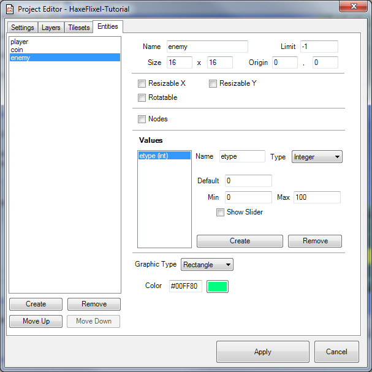
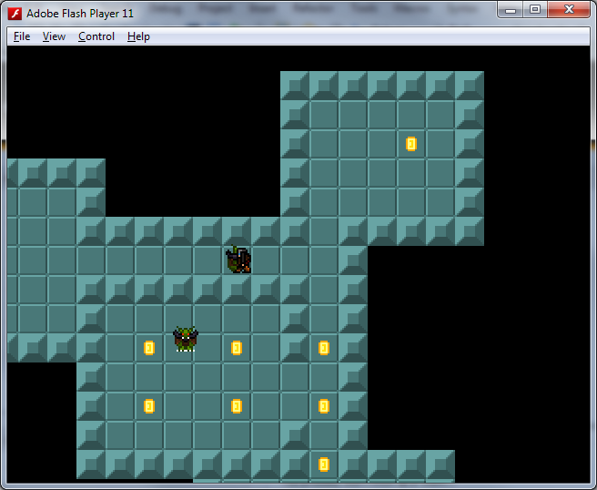

```
title: "Part VIII: Enemies and Basic AI"
```

<p>What would a dungeon game be without enemies? Let's add some!</p>

<ol>
	<li>
		<p>This should be second nature by now - add a new entity type in your Ogmo project:</p>
		<p></p>
		<p>Make sure you add the 'etype' value.</p>
	</li>
	<li>
		<p>Then scatter some enemies around the map. Make all but one of them have an etype value of '0', and the other one be '1'.</p>
		<p></p>
	</li>
	<li>
		<p>So we want to have 2 different enemies in our game. We'll need spritesheets for both of them, with 16x16 pixel frames and the same animation frames as our player. Name them 'enemy-0.png' and 'enemy-1.png' and put them in the 'assets/images' folder. You can use these, if you want (thanks, again, Vicky!):</p>
		<p><a href="https://github.com/HaxeFlixel/flixel-demos/blob/dev/Tutorials/TurnBasedRPG/assets/images/enemy-0.png"></a></p>
		<p><a href="https://github.com/HaxeFlixel/flixel-demos/blob/dev/Tutorials/TurnBasedRPG/assets/images/enemy-1.png"></a></p>
		<p>Note: make sure that your enemy sprites are functionally the same - they should have the same number of frames for each 'facing' animation.</p>
	</li>
	<li>
		<p>Let's add a new Enemy class. This class is going to look a lot like our Player class, with a few changes:</p>
		<p><pre><code class="haxe">class Enemy extends FlxSprite
{
	public var speed:Float = 140;
	public var etype(default, null):Int;
	
	public function new(X:Float=0, Y:Float=0, EType:Int) 
	{
		super(X, Y);
		etype = EType;
		loadGraphic("assets/images/enemy-" + Std.string(etype) + ".png", true, 16, 16);
		setFacingFlip(FlxObject.LEFT, false, false);
		setFacingFlip(FlxObject.RIGHT, true, false);
		animation.add("d", [0, 1, 0, 2], 6, false);
		animation.add("lr", [3, 4, 3, 5], 6, false);
		animation.add("u", [6, 7, 6, 8], 6, false);
		drag.x = drag.y = 10;
		width = 8;
		height = 14;
		offset.x = 4;
		offset.y = 2;
	}

	override public function draw():Void 
	{
		if ((velocity.x != 0 || velocity.y != 0 ) &amp;&amp; touching == FlxObject.NONE)
		{
			if (Math.abs(velocity.x) > Math.abs(velocity.y))
			{
				if (velocity.x &lt; 0)
					facing = FlxObject.LEFT;
				else
					facing = FlxObject.RIGHT;
			}
			else
			{
				if (velocity.y &lt; 0)
					facing = FlxObject.UP;
				else
					facing = FlxObject.DOWN;
			}

			switch(facing)
			{
				case FlxObject.LEFT, FlxObject.RIGHT:
					animation.play("lr");
					
				case FlxObject.UP:
					animation.play("u");
					
				case FlxObject.DOWN:
					animation.play("d");
			}
		}
		super.draw();
	}
}</code></pre></p>
		<p>The main difference is that we have a new etype variable, which we will use to figure out which enemy sprite to load, and which one we're dealing with, etc.</p>
	</li>
	<li>
		<p>Next, we'll make a FlxGroup in our PlayState to hold our Enemies, and load them into the map, very much the same way we did our coins.</p>
		<p>At the top of our class, add:</p>
		<p><pre><code class="haxe">private var _grpEnemies:FlxTypedGroup&lt;Enemy&gt;;</code></pre></p>
		<p>In the create function,  right after we add our coin group:</p>
		<p><pre><code class="haxe">_grpEnemies = new FlxTypedGroup&lt;Enemy&gt;();
add(_grpEnemies);</code></pre></p>
		<p>and at the end of our if/else statement in placeEntities:</p>
		<p><pre><code class="haxe">else if (entityName == "enemy")
{
	_grpEnemies.add(new Enemy(x + 4, y, Std.parseInt(entityData.get("etype"))));
}</code></pre></p>
	</li>
</ol>

<p>Go ahead and test out your game to make sure the enemies are added properly.</p>

<p>Now let's give them some brains.</p>

<p>In order to let our enemies 'think', we're going to utilize a very simple <a href="http://en.wikipedia.org/wiki/Finite_state_machine">Finite-state Machine (FSM)</a>. Basically, the FSM works by saying that a given machine (or entity) can only be in one state at a time. For our enemies, we're going to give them 2 possible states: Idle and Chase. When they can't 'see' the player, they will be Idle - wandering around aimlessly. Once the player is in view, however, they will switch to the Chase state and run towards the player.</p>

<ol>
	<li>
		<p>Shouldn't be that hard! First, we'll make our FSM class:</p>
		<p><pre><code class="haxe">class FSM
{
	public var activeState:Void-&gt;Void;
	
	public function new(?InitState:Void-&gt;Void):Void
	{
		activeState = InitState;
	}
	
	public function update():Void
	{
		if (activeState != null)
			activeState();
	}
}</code></pre></p>
	</li>
	<li>
		<p>Next, we'll change our Enemy class a little.</p>
		<p>We need to define these variables at the top of the class:</p>
		<p><pre><code class="haxe">private var _brain:FSM;
private var _idleTmr:Float;
private var _moveDir:Float;
public var seesPlayer:Bool = false;
public var playerPos(default, null):FlxPoint;</code></pre></p>
	</li>
	<li>
		<p>At the end of the constructor, add:</p>
		<p><pre><code class="haxe">_brain = new FSM(idle);
_idleTmr = 0;
playerPos = FlxPoint.get();</code></pre></p>
	</li>
	<li>
		<p>And then add the following functions:</p>
		<p><pre><code class="haxe">public function idle():Void
{
	if (seesPlayer)
	{
		_brain.activeState = chase;
	}
	else if (_idleTmr &lt;= 0)
	{
		if (FlxRandom.chanceRoll(1))
		{
			_moveDir = -1;
			velocity.x = velocity.y = 0;
		}
		else
		{
			_moveDir = FlxRandom.intRanged(0, 8) &#42; 45;
			FlxAngle.rotatePoint(speed * .5, 0, 0, 0, _moveDir, velocity);
		}
		_idleTmr = FlxRandom.intRanged(1, 4);
	}
	else
		_idleTmr -= FlxG.elapsed;
	}
}

public function chase():Void
{
	if (!seesPlayer)
	{
		_brain.activeState = idle;
	}
	else
	{
		FlxVelocity.moveTowardsPoint(this, playerPos, Std.int(speed));
	}
}

override public function update():Void 
{
    _brain.update();
    super.update();
}</code></pre></p>
		<p>The way this is going to work is that each enemy will start in the Idle state. In the PlayState we will have each enemy check to see if it can see the player or not. If it can, it will switch to the Chase state, until it can't see the player anymore. While in the Idle state, every so often (in random intervals) it will choose a random direction to move in for a little while (with a small chance to just stand still). While in the Chase state, they will move directly towards the player.</p>
	</li>
	<li>
		<p>Let's jump over to the PlayState to add our player's vision logic. In update, under the overlap and collision checks, add:</p>
		<p><pre><code class="haxe">FlxG.collide(_grpEnemies, _mWalls);
_grpEnemies.forEachAlive(checkEnemyVision);</code></pre></p>
	</li>
	<li>
		<p>Next, add the checkEnemyVision function:</p>
		<p><pre><code class="haxe">private function checkEnemyVision(e:Enemy):Void
{
	if (_mWalls.ray(e.getMidpoint(), _player.getMidpoint()))
	{
		e.seesPlayer = true;
		e.playerPos.copyFrom(_player.getMidpoint());
	}
	else
		e.seesPlayer = false;
}</code></pre></p>
	</li>
</ol>

<p>That's all there is to it! Try out your game and make sure it works!</p>
<p></p>
<p>Next, we'll add some UI to the game, and add our RPG-style Combat so you can fight the enemies!</p>
